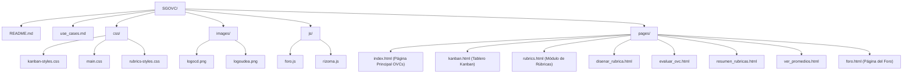

# SGOVC - Sistema de Gestión de Objetos Virtuales Creativos

## Descripción General

SGOVC es un **prototipo con funcionalidad simulada** de un sistema diseñado para la gestión integral de Objetos Virtuales Creativos (OVCs). Su objetivo principal es apoyar a los estudiantes del Pregrado en Creación Digital de la Universidad de Antioquia, facilitando los procesos de creación, organización, seguimiento, evaluación y colaboración en torno a sus OVCs. También ofrece herramientas para docentes y administradores del programa.

Este proyecto surge como una iniciativa para centralizar y enriquecer la experiencia de desarrollo y gestión de los OVCs, fomentando buenas prácticas y la interacción dentro de la comunidad académica.

## Características Principales

El sistema SGOVC cuenta con los siguientes módulos y funcionalidades clave:

*   **Gestión de OVCs:**
    *   Creación, edición y eliminación de OVCs.
    *   Definición de niveles de visibilidad (Privado, Miembros del Curso, Institucional, Público).
    *   Visualización de listas y detalles de OVCs.
    *   Gestión de versiones y colaboradores por OVC.
    *   (Simulado) Exportación de OVCs (Assets Unity/3D) a un videojuego con flujo de aprobación.

*   **Tablero Kanban:**
    *   Organización visual de tareas asociadas a cada OVC en columnas ("Por Hacer", "En Progreso", "Hecho").
    *   Funcionalidad de arrastrar y soltar (Drag & Drop) para mover tareas.
    *   Creación, edición y eliminación de tareas.
    *   Asignación de colores a las tareas para una mejor identificación visual.
    *   Vista consolidada de "Mis Tareas" para estudiantes.

*   **Visualización Rizomática:**
    *   Representación gráfica interactiva (utilizando D3.js) de la red de OVCs y sus interconexiones.
    *   Permite explorar las relaciones entre diferentes proyectos creativos.
    *   Funcionalidades de zoom, pan y acceso a detalles de OVCs desde la visualización.

*   **Sistema de Rúbricas y Evaluación:**
    *   **Diseño de Rúbricas:** Creación manual de rúbricas detalladas por parte de profesores y administradores.
    *   **Generación Asistida por IA:** Utilización de la API de Google Gemini para proponer estructuras de rúbricas basadas en temas o descripciones.
    *   **Evaluación de OVCs:** Aplicación de rúbricas para evaluar OVCs por parte de profesores, invitados y estudiantes (autoevaluación, coevaluación).
    *   **Visualización de Resultados:** Acceso a promedios de evaluación por OVC, detalles de evaluaciones individuales y resúmenes de rúbricas.

*   **Foro de Discusión:**
    *   Espacios de discusión asociados a cada OVC.
    *   Creación de temas y mensajes por parte de estudiantes, profesores y administradores.
    *   Moderación de contenidos (eliminación de temas/mensajes) por parte de administradores.

*   **Búsqueda Avanzada de OVCs (UC-702):**
    *   Capacidad para encontrar OVCs utilizando términos de búsqueda en campos específicos.
    *   Soporte para operadores booleanos (AND, OR, NOT) para refinar las búsquedas.
    *   Funcionalidad (simulada) de búsqueda semántica mediante IA (tipo Gemini API) para describir lo que se busca con un prompt.
    *   Búsqueda por similitud (fuzzy search) para encontrar términos aproximados o mal escritos.

*   **Gestión de Usuarios y Notificaciones:**
    *   Administración de cuentas de usuario (Estudiante, Profesor, Administrador, Invitado) con diferentes roles y permisos.
    *   Sistema de notificaciones para informar a los usuarios sobre eventos relevantes (nuevas tareas, invitaciones, mensajes en foros, evaluaciones).

## Tecnologías Utilizadas

Este prototipo se ha desarrollado principalmente con tecnologías frontend:

*   **Lenguajes Base:** HTML5, CSS3, JavaScript (ES6+)
*   **Framework CSS:** [Tailwind CSS](https://tailwindcss.com/) - Para la estilización rápida y utilitaria de la interfaz.
*   **Librerías JavaScript:**
    *   [SortableJS](https://sortablejs.github.io/Sortable/) - Para la funcionalidad de arrastrar y soltar en el tablero Kanban.
    *   [D3.js](https://d3js.org/) - Para la generación de la visualización Rizomática interactiva.
    *   [Alpine.js](https://alpinejs.dev/) - Para la interactividad en componentes específicos, como el módulo de Rúbricas.
*   **APIs Externas (Simuladas/Integradas):**
    *   Google Gemini API - Para la generación asistida de rúbricas.

## Estructura del Proyecto

A continuación, se muestra una representación de la estructura de directorios y archivos principales del proyecto:



## Cómo Empezar / Uso

Dado que es un prototipo frontend con funcionalidad simulada:

1.  Clona o descarga este repositorio.
2.  Abre el archivo `pages/index.html` en un navegador web moderno (como Chrome, Firefox, Edge).
3.  Explora las diferentes secciones y funcionalidades simuladas.

No se requiere instalación de dependencias complejas ni configuración de backend para la visualización básica del prototipo.

## Visión a Futuro

Este prototipo sienta las bases para un sistema más robusto. Algunas de las funcionalidades contempladas para futuras versiones, basadas en los casos de uso definidos, incluyen:

*   **UC-701: Gestionar Portafolio Personal de OVCs:** Permitir a los usuarios curar y presentar una selección de sus OVCs como un portafolio.
*   Implementación completa y optimizada de la **Búsqueda Avanzada de OVCs (UC-702)**, incluyendo la integración real con servicios de IA para la búsqueda semántica y la indexación eficiente del contenido de los OVCs.
*   **UC-705: Analíticas de Uso de OVCs:** Proveer estadísticas sobre cómo se visualizan y utilizan los OVCs.
*   Implementación completa de la persistencia de datos y la lógica de backend.

## Contribuciones

Por el momento, al ser un prototipo en desarrollo temprano, las contribuciones directas no están formalmente abiertas. Sin embargo, el feedback y las sugerencias son bienvenidos.

## Licencia

Este proyecto se distribuye bajo la **Licencia MIT**.

El texto completo de la licencia MIT es el siguiente:

```
MIT License

Copyright (c) [Año] [Nombre del Propietario del Copyright]

Permission is hereby granted, free of charge, to any person obtaining a copy
of this software and associated documentation files (the "Software"), to deal
in the Software without restriction, including without limitation the rights
to use, copy, modify, merge, publish, distribute, sublicense, and/or sell
copies of the Software, and to permit persons to whom the Software is
furnished to do so, subject to the following conditions:

The above copyright notice and this permission notice shall be included in all
copies or substantial portions of the Software.

THE SOFTWARE IS PROVIDED "AS IS", WITHOUT WARRANTY OF ANY KIND, EXPRESS OR
IMPLIED, INCLUDING BUT NOT LIMITED TO THE WARRANTIES OF MERCHANTABILITY,
FITNESS FOR A PARTICULAR PURPOSE AND NONINFRINGEMENT. IN NO EVENT SHALL THE
AUTHORS OR COPYRIGHT HOLDERS BE LIABLE FOR ANY CLAIM, DAMAGES OR OTHER
LIABILITY, WHETHER IN AN ACTION OF CONTRACT, TORT OR OTHERWISE, ARISING FROM,
OUT OF OR IN CONNECTION WITH THE SOFTWARE OR THE USE OR OTHER DEALINGS IN THE
SOFTWARE.
```

---
Hecho con ❤️ por el equipo de desarrollo del Pregrado en Creación Digital.
