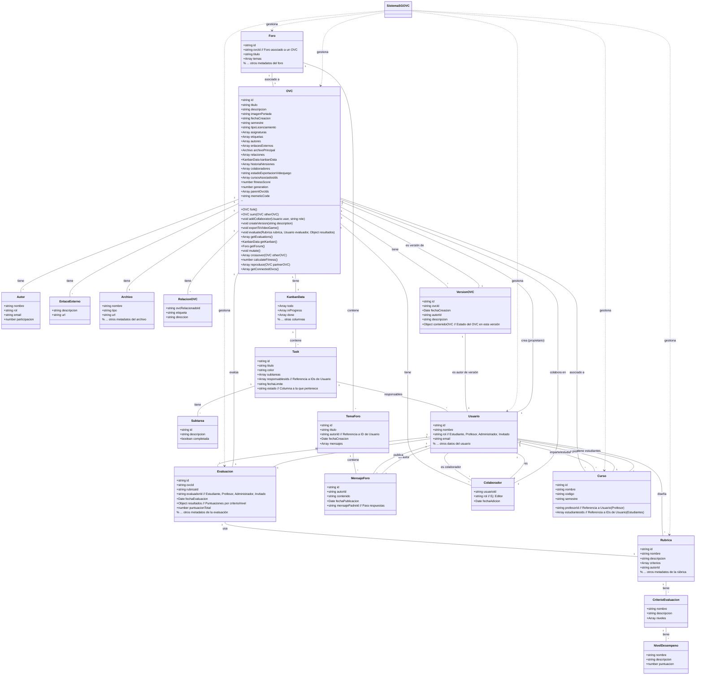

# Diagrama de Clases - Sistema de Gestión de Objetos Virtuales Creativos (SGOVC)

Este documento presenta un diagrama de clases que describe las principales entidades y sus relaciones dentro del Sistema de Gestión de Objetos Virtuales Creativos (SGOVC). El diagrama se basa en la información recopilada de la estructura del OVC en `index.html`, los campos del formulario "Crear OVC", los módulos de Kanban, Rúbricas, Foro y Rizoma, así como los casos de uso descritos en `use_cases.md`. Se enriquece el concepto de OVC al considerarlo como un objeto con métodos propios.

## Diagrama de Clases

## Descripción de Clases y Relaciones

### OVC (Objeto Virtual Creativo)

Representa el objeto principal del sistema.

*   **Atributos:** `id`, `titulo`, `descripcion`, `imagenPortada`, `fechaCreacion`, `semestre`, `tipoLicenciamiento`, `asignaturas` (lista de nombres de asignaturas), `etiquetas` (lista de strings), `estadoExportacionVideojuego` (estado actual del proceso de exportación al videojuego), `cursosAsociadosIds` (lista de IDs de cursos a los que está asociado el OVC), `fitnessScore` (puntuación de aptitud), `generation` (generación evolutiva), `parentOvcIds` (IDs de OVCs padres), `memeticCode` (código memético/genético).
*   **Relaciones:**
    *   Tiene muchos `Autor`es.
    *   Tiene muchos `EnlaceExterno`s.
    *   Tiene un `Archivo` principal.
    *   Tiene muchas `RelacionOVC`s con otros OVCs.
    *   Tiene un `KanbanData` asociado.
    *   Tiene un historial de `VersionOVC`s.
    *   Tiene muchos `Colaborador`es.
    *   Está asociado a muchos `Curso`s.
    *   Es creado por un `Usuario` (propietario).
    *   Es evaluado en muchas `Evaluacion`es.
    *   Tiene un `Foro` asociado.

### Autor

Representa a una persona que contribuyó a la creación de un OVC.

*   **Atributos:** `nombre`, `rol`, `email`, `participacion` (porcentaje).
*   **Relaciones:** Es parte de un `OVC`.

### EnlaceExterno

Representa un enlace a un recurso externo relacionado con el OVC.

*   **Atributos:** `descripcion`, `url`.
*   **Relaciones:** Es parte de un `OVC`.

### Archivo

Representa el archivo principal asociado a un OVC.

*   **Atributos:** `nombre`, `tipo`, `url`.
*   **Relaciones:** Es el archivo principal de un `OVC`.

### RelacionOVC

Representa una relación entre dos OVCs.

*   **Atributos:** `ovcRelacionadoId` (ID del otro OVC), `etiqueta` (descripción de la relación), `direccion` (saliente, entrante, bidireccional).
*   **Relaciones:** Es parte de un `OVC`.

### KanbanData

Contiene la estructura de datos para el tablero Kanban de un OVC.

*   **Atributos:** `todo`, `inProgress`, `done` (arrays de `Task`), y potencialmente otras columnas.
*   **Relaciones:** Contiene muchas `Task`s. Es parte de un `OVC`.

### Task

Representa una tarea dentro del tablero Kanban de un OVC.

*   **Atributos:** `id`, `titulo`, `color`, `fechaLimite`, `estado` (columna a la que pertenece).
*   **Relaciones:** Tiene muchas `Subtarea`s. Tiene muchos `Usuario`s responsables. Es parte de `KanbanData`.

### Subtarea

Representa una subtarea dentro de una tarea del Kanban.

*   **Atributos:** `id`, `descripcion`, `completada` (booleano).
*   **Relaciones:** Es parte de una `Task`.

### Rubrica

Representa una rúbrica de evaluación.

*   **Atributos:** `id`, `nombre`, `descripcion`, `autorId` (ID del usuario que diseñó la rúbrica).
*   **Relaciones:** Tiene muchos `CriterioEvaluacion`es. Es diseñada por un `Usuario`. Es utilizada en muchas `Evaluacion`es.

### CriterioEvaluacion

Representa un criterio específico dentro de una rúbrica.

*   **Atributos:** `nombre`, `descripcion`.
*   **Relaciones:** Tiene muchos `NivelDesempeno`s. Es parte de una `Rubrica`.

### NivelDesempeno

Representa un nivel de desempeño para un criterio de evaluación.

*   **Atributos:** `nombre`, `descripcion`, `puntuacion`.
*   **Relaciones:** Es parte de un `CriterioEvaluacion`.

### Evaluacion

Representa una evaluación de un OVC utilizando una rúbrica.

*   **Atributos:** `id`, `ovcId` (ID del OVC evaluado), `rubricaId` (ID de la rúbrica utilizada), `evaluadorId` (ID del usuario que realizó la evaluación), `fechaEvaluacion`, `resultados` (detalle de las puntuaciones por criterio/nivel), `puntuacionTotal`.
*   **Relaciones:** Evalúa un `OVC`. Usa una `Rubrica`. Es realizada por un `Usuario`.

### TemaForo

Representa un tema de discusión dentro de un foro.

*   **Atributos:** `id`, `titulo`, `autorId` (ID del usuario que creó el tema), `fechaCreacion`.
*   **Relaciones:** Contiene muchos `MensajeForo`s. Es parte de un `Foro`.

### Foro

Representa un foro de discusión asociado a un OVC.

*   **Atributos:** `id`, `ovcId` (ID del OVC asociado), `titulo`.
*   **Relaciones:** Contiene muchos `TemaForo`s. Está asociado a un `OVC`.

### MensajeForo

Representa un mensaje dentro de un foro.

*   **Atributos:** `id`, `autorId` (ID del usuario que publicó el mensaje), `contenido`, `fechaPublicacion`, `mensajePadreId` (ID del mensaje al que responde, si aplica).
*   **Relaciones:** Es publicado por un `Usuario`. Es parte de un `TemaForo`.

### Usuario

Representa a un usuario del sistema.

*   **Atributos:** `id`, `nombre`, `rol` (Estudiante, Profesor, Administrador, Invitado), `email`.
*   **Relaciones:** Crea muchos `OVC`s (como propietario). Diseña muchas `Rubrica`s. Realiza muchas `Evaluacion`es. Publica muchos `MensajeForo`s. Es `Colaborador` en muchos OVCs. Imparte o estudia en muchos `Curso`s.

### VersionOVC

Representa una versión guardada del estado de un OVC.

*   **Atributos:** `id`, `ovcId` (ID del OVC al que pertenece la versión), `fechaCreacion`, `autorId` (ID del usuario que creó la versión), `descripcion`, `contenidoOVC` (una instantánea de los datos del OVC en ese momento).
*   **Relaciones:** Es una versión de un `OVC`. Es creada por un `Usuario`.

### Colaborador

Representa la relación entre un Usuario y un OVC en el que colabora.

*   **Atributos:** `usuarioId` (ID del usuario colaborador), `rol` (ej: Editor), `fechaAdicion).
*   **Relaciones:** Es un `Usuario`. Colabora en un `OVC`.

### Curso

Representa un curso académico.

*   **Atributos:** `id`, `nombre`, `codigo`, `semestre`, `profesorId` (ID del usuario profesor).
*   **Relaciones:** Tiene un `Usuario` como profesor. Tiene muchos `Usuario`s como estudiantes. Muchos `OVC`s pueden estar asociados a un curso.

## OVC como Objeto: Métodos y Enriquecimiento del Concepto

Considerar el OVC como un objeto con métodos propios permite encapsular funcionalidades directamente relacionadas con la gestión y manipulación de un OVC individual. Esto no solo organiza mejor el código, sino que también abre la puerta a interacciones más ricas y semánticas dentro del sistema.

Los métodos propuestos para la clase `OVC` son:

*   `fork()`: Este método permitiría crear una copia de un OVC existente. Sería útil para que los estudiantes o profesores puedan tomar un OVC como punto de partida para un nuevo proyecto, manteniendo un vínculo con el original (posiblemente a través de una relación o en el historial de versiones). El método devolvería una nueva instancia de `OVC` con los datos copiados.
*   `sum(OVC otherOVC)`: Este método representaría la combinación o integración de dos OVCs en uno nuevo. La lógica exacta de cómo se "suman" los contenidos, metadatos, autores, etc., dependería de los requisitos específicos, pero la idea es crear un OVC resultante que herede o fusione aspectos de los dos OVCs de origen. Devolvería una nueva instancia de `OVC`.
*   `addCollaborator(Usuario user, string role)`: Un método para añadir un usuario como colaborador a este OVC específico, asignándole un rol.
*   `createVersion(string description)`: Permite guardar el estado actual del OVC como una nueva versión en su historial.
*   `exportToVideoGame()`: Inicia el proceso de exportación de este OVC al videojuego, cambiando su estado y potencialmente activando flujos de aprobación.
*   `evaluate(Rubrica rubrica, Usuario evaluador, Object resultados)`: Permite registrar una evaluación para este OVC utilizando una rúbrica específica y los resultados proporcionados por un evaluador.
*   `getEvaluations()`: Devuelve una lista de todas las evaluaciones asociadas a este OVC.
*   `getKanban()`: Devuelve los datos del tablero Kanban asociado a este OVC.
*   `getForum()`: Devuelve el foro de discusión asociado a este OVC.
*   `mutate()`: Simula una mutación, introduciendo cambios aleatorios en los atributos o contenido del OVC, alineado con la computación evolutiva.
*   `crossover(OVC otherOVC)`: Simula el cruce genético entre este OVC y otro, combinando sus características para producir nuevos OVCs (descendencia), fundamental en la computación evolutiva.
*   `calculateFitness()`: Calcula la puntuación de aptitud (`fitnessScore`) del OVC basándose en criterios definidos, esencial para la selección en algoritmos evolutivos.
*   `reproduce(OVC partnerOVC)`: Un método de alto nivel que orquesta los procesos de `crossover` y `mutate` para generar nuevos OVCs, representando la reproducción en un contexto evolutivo.
*   `getConnectedOvcs()`: Devuelve una lista de OVCs directamente conectados a este OVC a través de sus `RelacionOVC`s, facilitando la navegación por la estructura de Rizoma.

Este enfoque orientado a objetos para el OVC facilita la implementación de las funcionalidades descritas en los casos de uso, al agrupar los datos y el comportamiento relacionado en una única entidad lógica. La adición de atributos y métodos relacionados con la memética y la computación evolutiva enriquece el modelo para permitir la simulación de procesos de evolución cultural y adaptación de los OVCs dentro del sistema.

## OVC como Meme: Métodos y Enriquecimiento del Concepto

Inspirados por la **memética**, que estudia las ideas y elementos culturales como "memes" que se replican y evolucionan de manera análoga a los genes biológicos, y la **computación evolutiva**, que aplica principios de la evolución natural a la resolución de problemas computacionales, podemos conceptualizar los OVCs no solo como objetos estáticos, sino como entidades dinámicas que pueden "evolucionar" dentro del sistema.

Desde esta perspectiva, cada OVC puede ser visto como un "cromosoma" o "meme" digital, portador de información (sus atributos y contenido) que puede ser transmitida, modificada y combinada. Los procesos de creación, modificación, fork y suma de OVCs se convierten en mecanismos de replicación y variación.

Para modelar esta dimensión evolutiva, hemos añadido los siguientes atributos y métodos a la clase `OVC`:

*   **Atributos:**
    *   `fitnessScore` (número): Representa la "aptitud" o éxito del OVC en el entorno del sistema. Esta puntuación podría calcularse basándose en métricas como la frecuencia de uso, las evaluaciones recibidas, el número de veces que ha sido "forkeado" o utilizado en operaciones de "suma", la actividad en su foro asociado, etc. Un mayor `fitnessScore` indicaría un OVC más "exitoso" o influyente en el ecosistema del SGOVC.
    *   `generation` (número): Un contador que indica la generación evolutiva a la que pertenece el OVC. Los OVCs originales podrían ser la generación 0, y cada vez que se crea un nuevo OVC a través de procesos de "reproducción" (como fork o suma), la generación se incrementaría.
    *   `parentOvcIds` (Array<string>): Una lista de los IDs de los OVCs de los cuales este OVC fue derivado (por ejemplo, los OVCs originales en una operación de "suma" o el OVC original en un "fork"). Esto permite rastrear el linaje y la historia evolutiva de un OVC.
    *   `memeticCode` (string): Una representación simplificada o "código genético" del OVC. Este código podría ser generado a partir de un hash de sus atributos clave o contenido, sirviendo como una huella digital que facilita la identificación de similitudes y diferencias entre OVCs para operaciones de mutación y cruce.

*   **Métodos:**
    *   `mutate()`: Este método simularía el proceso de mutación. Al ser invocado, introduciría pequeños cambios aleatorios en los atributos o, conceptualmente, en el "contenido" del OVC. La naturaleza y probabilidad de estas mutaciones dependerían de la implementación específica y podrían variar en complejidad.
    *   `crossover(OVC otherOVC)`: Implementa el proceso de cruce genético. Tomaría otro OVC como "pareja" y combinaría características de ambos para producir uno o más nuevos OVCs ("descendencia"). La lógica de combinación dependería de cómo se defina el `memeticCode` y qué atributos o partes del contenido son susceptibles de cruzarse. Devolvería un array de nuevos OVCs resultantes del cruce.
    *   `calculateFitness()`: Un método para calcular y actualizar el `fitnessScore` del OVC. Este cálculo se basaría en las métricas de éxito definidas previamente, reflejando cómo el OVC se ha "adaptado" o ha sido "seleccionado" por la comunidad de usuarios.
    *   `reproduce(OVC partnerOVC)`: Este método de alto nivel orquestaría los procesos de `crossover` y `mutate`. Podría tomar otro OVC como pareja (para el cruce) y luego aplicar mutaciones a la descendencia resultante. Devolvería un array de nuevos OVCs generados a través de este proceso de "reproducción" evolutiva.

Esta conceptualización del OVC como meme y la incorporación de estos elementos relacionados con la computación evolutiva abren la puerta a funcionalidades avanzadas como la generación automática de nuevas ideas de OVCs, la identificación de OVCs "exitosos" o influyentes, y la simulación de la evolución de conceptos creativos dentro del sistema.

## OVC como Objeto Virtual de Aprendizaje (OVA): Métodos y Enriquecimiento del Concepto

Desde la perspectiva de la **UNESCO**, un Objeto Virtual de Aprendizaje (OVA) es "un conjunto de recursos digitales, autocontenible y reutilizable, con un propósito educativo y constituido por al menos tres componentes internos: contenidos, actividades de aprendizaje y elementos de contextualización. El objeto de aprendizaje debe tener una estructura de información externa (metadatos) que facilite su almacenamiento, identificación y recuperación".

Al considerar el OVC como un OVA, enriquecemos su definición al enfatizar su potencial educativo y su estructura orientada al aprendizaje. Esto implica que un OVC no es solo un producto creativo, sino también una herramienta diseñada para facilitar la adquisición de conocimientos y el desarrollo de habilidades.

Si bien muchos de los atributos y relaciones existentes en la clase `OVC` ya se alinean con la definición de OVA (como `titulo`, `descripcion`, `archivoPrincipal`, `etiquetas`, `asignaturas`, `cursosAsociadosIds`), podemos considerar la adición de atributos y métodos que refuercen explícitamente su rol educativo:

*   **Atributos Adicionales Potenciales:**
    *   `objetivosAprendizaje` (Array<string>): Una lista de los objetivos de aprendizaje que el OVC ayuda a alcanzar.
    *   `audienciaMeta` (Array<string>): Describe a quién está dirigido el OVC (ej: estudiantes universitarios, profesores de secundaria, público general).
    *   `requisitosPrevios` (Array<string>): Conocimientos o habilidades que se necesitan antes de utilizar el OVC.
    *   `tiempoEstimadoAprendizaje` (string): Una estimación del tiempo que tomará interactuar con el OVC para lograr los objetivos de aprendizaje.
    *   `metadatosEducativos` (Object): Un objeto que contenga metadatos estandarizados según modelos como LOM (Learning Object Metadata) para facilitar la interoperabilidad y búsqueda en repositorios de OVAs.

*   **Métodos Adicionales Potenciales:**
    *   `getLearningObjectives()`: Devuelve los objetivos de aprendizaje asociados al OVC.
    *   `getMetadata(format)`: Permite obtener los metadatos educativos en un formato específico (ej: LOM).
    *   `associateToCourse(Curso curso)`: Un método explícito para vincular el OVC a un curso, reforzando su uso en un contexto educativo formal. (Aunque ya existe `cursosAsociadosIds`, un método podría encapsular la lógica de asociación).

La integración de la perspectiva de OVA en la clase `OVC` no solo mejora su descripción como recurso educativo, sino que también sienta las bases para futuras funcionalidades relacionadas con la gestión de repositorios de OVAs, la recomendación de OVCs para cursos específicos, y la evaluación de su efectividad pedagógica.

## OVC como Rizoma y Cerebro Digital

El concepto de **Rizoma**, desarrollado por Deleuze y Guattari, describe una estructura no jerárquica, acentrada y multidireccional, donde cualquier punto puede conectarse con cualquier otro. Aplicado a los OVCs, esto significa que la colección de Objetos Virtuales Creativos en el sistema no es una simple lista o árbol, sino una red compleja donde los OVCs se interconectan a través de diversas **RelacionOVC**s.

Esta red interconectada de OVCs puede ser vista como un **"Cerebro Digital"** colectivo. Al igual que las neuronas en un cerebro biológico se conectan para formar pensamientos e ideas complejas, los OVCs se enlazan para representar y generar conocimiento de manera dinámica y emergente. Las relaciones entre OVCs (`RelacionOVC`) actúan como las sinapsis, transmitiendo significado y contexto a través de la red.

Desde esta perspectiva, el valor de un OVC no reside solo en su contenido individual, sino también en su posición y conexiones dentro de este "Cerebro Digital". La navegación a través de las relaciones (`RelacionOVC`) permite a los usuarios explorar el espacio de conocimiento de manera no lineal, descubriendo conexiones inesperadas y fomentando la creatividad.

Para facilitar la interacción con esta estructura de Rizoma/Cerebro Digital, la clase `OVC` ya incluye el atributo `relaciones` (`Array<RelacionOVC>`). Hemos añadido el método `getConnectedOvcs()` para permitir la exploración de estas conexiones. Otros métodos potenciales podrían incluir:

*   **Métodos Adicionales Potenciales:**
    *   `getRelationships(OVC otherOVC)`: Devuelve las `RelacionOVC`s específicas que existen entre este OVC y otro OVC dado.
    *   `findPathTo(OVC targetOVC)`: (Más avanzado) Implementa un algoritmo de búsqueda en grafos para encontrar un camino de relaciones entre este OVC y un OVC objetivo.

La clase `RelacionOVC` es fundamental en esta conceptualización, ya que define la naturaleza de las conexiones. Sus atributos `ovcRelacionadoId`, `etiqueta` y `direccion` son clave para construir y entender el grafo. Podríamos considerar añadir atributos para la "fuerza" o "confianza" de una relación si fuera necesario modelar la prominencia de ciertas conexiones.

Al visualizar y navegar esta red de OVCs como un Rizoma/Cerebro Digital, el sistema SGOVC se convierte en una plataforma dinámica para la creación, evolución y descubrimiento de conocimiento, reflejando la naturaleza interconectada y fluida de las ideas creativas.

## Decisiones de Diseño

*   Se ha optado por representar las relaciones "muchos a muchos" (como OVCs y Cursos, o Tareas y Responsables) mediante arrays de IDs en las clases correspondientes para simplificar el modelo a nivel conceptual. La implementación real podría requerir tablas de unión en una base de datos relacional.
*   La información del Kanban se agrupa en la clase `KanbanData` dentro del OVC para mantener la cohesión de los datos relacionados con un OVC específico.
*   Las subtareas se modelan como una clase separada para permitirles tener sus propios atributos (como estado de completado).
*   Se incluye una clase `Curso` para reflejar la organización académica y su relación con OVCs y Usuarios, lo cual es relevante en el contexto universitario del proyecto.
*   El historial de versiones y los colaboradores se modelan como clases separadas para gestionar su información y relaciones de manera clara.
*   Se han añadido métodos a la clase `OVC` para encapsular comportamientos clave, promoviendo un diseño más orientado a objetos.
*   Se han incorporado atributos y métodos a la clase `OVC` para modelar conceptos de memética y computación evolutiva, permitiendo tratar los OVCs como entidades que pueden evolucionar.
*   Se han sugerido atributos y métodos adicionales para la clase `OVC` con el fin de enriquecer su definición como Objeto Virtual de Aprendizaje (OVA), alineándose con estándares educativos y facilitando su uso en contextos pedagógicos.
*   Se ha añadido una sección para conceptualizar el grafo de OVCs como un Rizoma/Cerebro Digital, destacando la importancia de las relaciones (`RelacionOVC`) y sugiriendo métodos para la navegación del grafo.