# Diagramas de Flujo para Casos de Uso SGOVC

Este documento contiene los diagramas de flujo en formato Mermaid para los casos de uso relevantes del Sistema de Gestión de Objetos Virtuales Creativos (SGOVC), como complemento al documento `use_cases.md`.

## Resumen del Plan y Tareas Realizadas

1.  **Lectura Inicial del Documento:**
    *   Se leyó el documento `use_cases.md` para comprender su contenido y los casos de uso definidos.

2.  **Identificación y Creación de Diagramas de Flujo:**
    *   Se identificó que el caso de uso `UC-108: Exportar OVC a Videojuego con Aprobación` ya contaba con un diagrama de flujo en formato Mermaid en el documento original.
    *   Para los demás casos de uso relevantes que no tenían diagrama, se procedió a crear uno por uno, presentándolo para revisión y aprobación. Se realizaron ajustes en la sintaxis de Mermaid cuando fue necesario para asegurar la correcta previsualización.

3.  **Casos de Uso Cubiertos con Nuevos Diagramas de Flujo:**
    *   **Gestión de OVCs:**
        *   `UC-101: Crear OVC`
        *   `UC-102: Ver Lista de OVCs`
        *   `UC-103: Ver Detalles de OVC`
        *   `UC-104: Editar OVC`
        *   `UC-105: Eliminar OVC`
        *   `UC-106: Gestionar Versiones de OVC`
        *   `UC-107: Gestionar Colaboradores de OVC`
    *   **Sistema de Evaluación:**
        *   `UC-201: Diseñar Rúbrica`
        *   `UC-202: Evaluar OVC Usando Rúbrica`
        *   `UC-203: Ver Promedios de Evaluación de OVC`
        *   `UC-204: Resumir Rúbricas`
        *   `UC-205: Ver Lista de Rúbricas`
        *   `UC-206: Ver Detalles de Rúbrica`
        *   `UC-207: Eliminar Rúbrica`
        *   `UC-208: Realizar Evaluación como Invitado`
    *   **Tablero Kanban:**
        *   `UC-301: Usar Tablero Kanban`
        *   `UC-302: Gestionar Tareas en Kanban`
        *   `UC-303: Visualizar Tareas Propias en Kanban`
    *   **Visualización Rizoma:**
        *   `UC-304: Ver Visualización Rizoma`
    *   **Foro:**
        *   `UC-401: Ver Foro de OVC`
        *   `UC-402: Crear Tema en Foro`
        *   `UC-403: Crear Mensaje en Tema de Foro`
        *   `UC-404: Moderar Foro (Eliminar Temas/Mensajes)`
    *   **Administración:**
        *   `UC-501: Gestionar Usuarios (Crear, Editar, Eliminar)`
    *   **Notificaciones (General):**
        *   `UC-601: Recibir Notificaciones`

---

## Diagramas de Flujo por Caso de Uso

### UC-101: Crear OVC

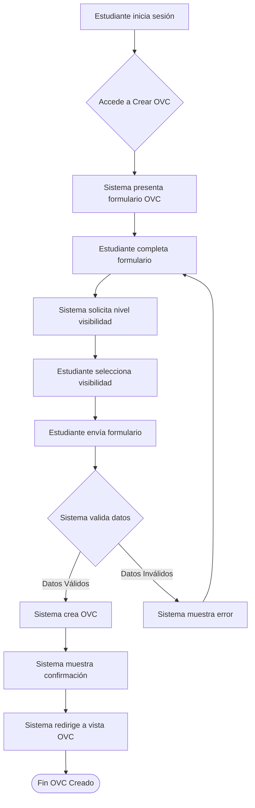
```mermaid
graph TD
    A["Estudiante inicia sesión"] --> B{"Accede a Crear OVC"}
    B --> C["Sistema presenta formulario OVC"]
    C --> D["Estudiante completa formulario"]
    D --> E["Sistema solicita nivel visibilidad"]
    E --> F["Estudiante selecciona visibilidad"]
    F --> G["Estudiante envía formulario"]
    G --> H{"Sistema valida datos"}
    H -- "Datos Válidos" --> I["Sistema crea OVC"]
    I --> J["Sistema muestra confirmación"]
    J --> K["Sistema redirige a vista OVC"]
    K --> L(["Fin OVC Creado"])
    H -- "Datos Inválidos" --> M["Sistema muestra error"]
    M --> D
```

**Explicación del Proceso:**
1.  El **Estudiante** inicia el proceso accediendo a la funcionalidad para crear un nuevo Objeto Virtual Creativo (OVC).
2.  El **Sistema** le presenta un formulario donde debe ingresar toda la información relevante del OVC.
3.  El **Estudiante** completa este formulario.
4.  El **Sistema** luego le pide al Estudiante que defina quién podrá ver este OVC (nivel de visibilidad).
5.  Una vez el **Estudiante** selecciona la visibilidad y envía todos los datos.
6.  El **Sistema** verifica que toda la información sea correcta.
    *   Si hay errores, se le informa al **Estudiante** para que los corrija.
    *   Si todo es correcto, el **Sistema** crea el OVC.
7.  Finalmente, el **Sistema** confirma la creación y lleva al **Estudiante** a una página donde puede ver su nuevo OVC, su lista de OVCs o el rizoma.

### UC-102: Ver Lista de OVCs

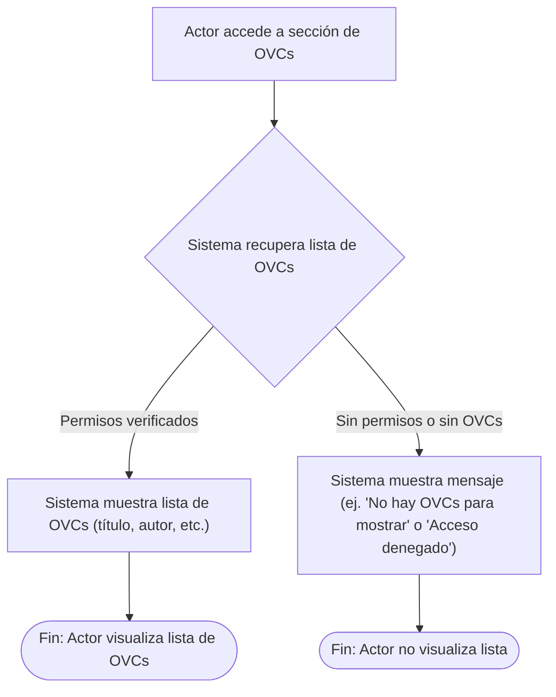
```mermaid
graph TD
    A["Actor accede a sección de OVCs"] --> B{"Sistema recupera lista de OVCs"}
    B -- "Permisos verificados" --> C["Sistema muestra lista de OVCs (título, autor, etc.)"]
    C --> D(["Fin: Actor visualiza lista de OVCs"])
    B -- "Sin permisos o sin OVCs" --> E["Sistema muestra mensaje (ej. 'No hay OVCs para mostrar' o 'Acceso denegado')"]
    E --> F(["Fin: Actor no visualiza lista"])
```

**Explicación del Proceso:**
1.  Un **Actor** (Estudiante, Profesor, Administrador o Invitado) accede a la sección donde se listan los OVCs.
2.  El **Sistema** verifica los permisos del Actor y recupera la lista de OVCs a los que tiene acceso.
3.  Si hay OVCs y el Actor tiene permisos, el **Sistema** muestra la lista con información relevante.
4.  Si no hay OVCs para mostrar o el Actor no tiene los permisos necesarios, el **Sistema** muestra un mensaje apropiado.

### UC-103: Ver Detalles de OVC

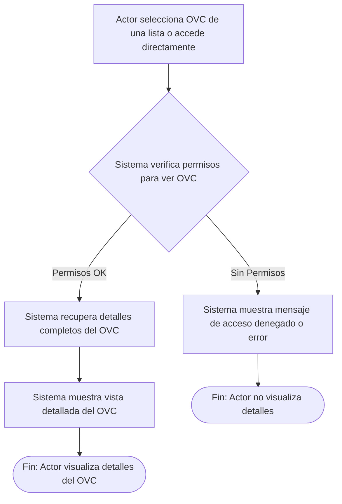
```mermaid
graph TD
    A["Actor selecciona OVC de una lista o accede directamente"] --> B{Sistema verifica permisos para ver OVC}
    B -- "Permisos OK" --> C["Sistema recupera detalles completos del OVC"]
    C --> D["Sistema muestra vista detallada del OVC"]
    D --> E(["Fin: Actor visualiza detalles del OVC"])
    B -- "Sin Permisos" --> F["Sistema muestra mensaje de acceso denegado o error"]
    F --> G(["Fin: Actor no visualiza detalles"])
```

**Explicación del Proceso:**
1.  Un **Actor** selecciona un OVC específico, ya sea desde una lista o accediendo a él directamente (por ejemplo, a través de un enlace).
2.  El **Sistema** primero verifica si el Actor tiene los permisos necesarios para ver los detalles de ese OVC en particular.
3.  Si el Actor tiene permiso, el **Sistema** recupera toda la información detallada del OVC (descripción, archivos, metadatos, etc.).
4.  Luego, el **Sistema** presenta esta información detallada al Actor.
5.  Si el Actor no tiene los permisos requeridos, el **Sistema** muestra un mensaje indicando que el acceso está denegado o que ha ocurrido un error.

### UC-104: Editar OVC

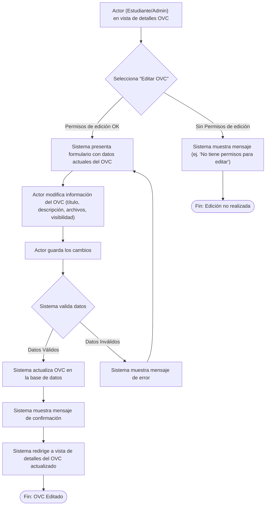
```mermaid
graph TD
    A["Actor (Estudiante/Admin) en vista de detalles OVC"] --> B{Selecciona &quot;Editar OVC&quot;}
    B -- "Permisos de edición OK" --> C["Sistema presenta formulario con datos actuales del OVC"]
    C --> D["Actor modifica información del OVC (título, descripción, archivos, visibilidad)"]
    D --> E["Actor guarda los cambios"]
    E --> F{Sistema valida datos}
    F -- "Datos Válidos" --> G["Sistema actualiza OVC en la base de datos"]
    G --> H["Sistema muestra mensaje de confirmación"]
    H --> I["Sistema redirige a vista de detalles del OVC actualizado"]
    I --> J(["Fin: OVC Editado"])
    F -- "Datos Inválidos" --> K["Sistema muestra mensaje de error"]
    K --> C
    B -- "Sin Permisos de edición" --> L["Sistema muestra mensaje (ej. 'No tiene permisos para editar')"]
    L --> M(["Fin: Edición no realizada"])
```

**Explicación del Proceso:**
1.  Un **Actor** (Estudiante propietario del OVC o un Administrador) se encuentra en la página de detalles de un OVC y selecciona la opción para editarlo.
2.  El **Sistema** verifica si el Actor tiene los permisos necesarios para editar ese OVC.
3.  Si tiene permisos, el **Sistema** muestra un formulario con la información actual del OVC.
4.  El **Actor** realiza las modificaciones deseadas (puede cambiar título, descripción, archivos, nivel de visibilidad, etc.).
5.  El **Actor** guarda los cambios.
6.  El **Sistema** valida los datos ingresados.
    *   Si los datos son válidos, el **Sistema** actualiza la información del OVC.
    *   Luego, muestra un mensaje de confirmación y redirige al Actor a la vista actualizada del OVC.
    *   Si los datos no son válidos, el **Sistema** muestra un mensaje de error y permite al Actor corregir la información.
7.  Si el Actor no tenía permisos para editar inicialmente, el **Sistema** muestra un mensaje indicándolo.

### UC-105: Eliminar OVC

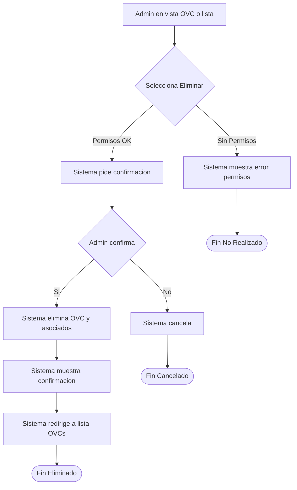
```mermaid
graph TD
    A["Admin en vista OVC o lista"] --> B{Selecciona Eliminar}
    B -- "Permisos OK" --> C["Sistema pide confirmacion"]
    C --> D{Admin confirma}
    D -- "Si" --> E["Sistema elimina OVC y asociados"]
    E --> F["Sistema muestra confirmacion"]
    F --> G["Sistema redirige a lista OVCs"]
    G --> H(["Fin Eliminado"])
    D -- "No" --> I["Sistema cancela"]
    I --> J(["Fin Cancelado"])
    B -- "Sin Permisos" --> K["Sistema muestra error permisos"]
    K --> L(["Fin No Realizado"])
```

**Explicación del Proceso:**
1.  Un **Administrador** está viendo los detalles de un OVC o una lista de OVCs y selecciona la opción para eliminar un OVC específico.
2.  El **Sistema** verifica si el Administrador tiene los permisos necesarios para eliminar OVCs.
3.  Si tiene permisos, el **Sistema** pide una confirmación antes de proceder con la eliminación.
4.  El **Administrador** confirma que desea eliminar el OVC.
    *   Si confirma, el **Sistema** elimina el OVC y toda su información relacionada (como evaluaciones, tareas del tablero Kanban, temas de foro, etc.).
    *   Luego, muestra un mensaje de confirmación y redirige al Administrador a la lista de OVCs.
    *   Si el Administrador cancela la eliminación, el **Sistema** no realiza ninguna acción.
5.  Si el Administrador no tenía permisos para eliminar inicialmente, el **Sistema** muestra un mensaje indicándolo.

### UC-106: Gestionar Versiones de OVC

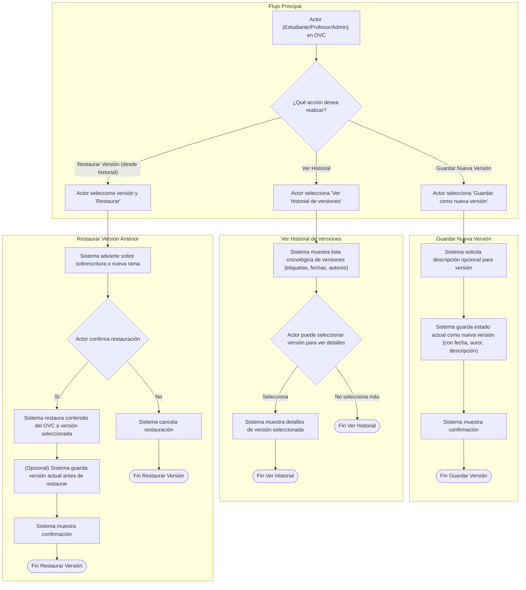
```mermaid
graph TD
    subgraph "Flujo Principal"
        A["Actor (Estudiante/Profesor/Admin) en OVC"] --> B{¿Qué acción desea realizar?}
        B -- "Guardar Nueva Versión" --> GV1["Actor selecciona 'Guardar como nueva versión'"]
        B -- "Ver Historial" --> VH1["Actor selecciona 'Ver historial de versiones'"]
        B -- "Restaurar Versión (desde historial)" --> RV1["Actor selecciona versión y 'Restaurar'"]
    end

    subgraph "Guardar Nueva Versión"
        GV1 --> GV2["Sistema solicita descripción opcional para versión"]
        GV2 --> GV3["Sistema guarda estado actual como nueva versión (con fecha, autor, descripción)"]
        GV3 --> GV4["Sistema muestra confirmación"]
        GV4 --> FIN_GV([Fin Guardar Versión])
    end

    subgraph "Ver Historial de Versiones"
        VH1 --> VH2["Sistema muestra lista cronológica de versiones (etiquetas, fechas, autores)"]
        VH2 --> VH3{Actor puede seleccionar versión para ver detalles}
        VH3 -- "Selecciona" --> VH4["Sistema muestra detalles de versión seleccionada"]
        VH4 --> FIN_VH([Fin Ver Historial])
        VH3 -- "No selecciona más" --> FIN_VH2([Fin Ver Historial])
    end

    subgraph "Restaurar Versión Anterior"
        RV1 --> RV2["Sistema advierte sobre sobrescritura o nueva rama"]
        RV2 --> RV3{Actor confirma restauración}
        RV3 -- "Sí" --> RV4["Sistema restaura contenido del OVC a versión seleccionada"]
        RV4 --> RV5["(Opcional) Sistema guarda versión actual antes de restaurar"]
        RV5 --> RV6["Sistema muestra confirmación"]
        RV6 --> FIN_RV([Fin Restaurar Versión])
        RV3 -- "No" --> RV7["Sistema cancela restauración"]
        RV7 --> FIN_RV_CANC([Fin Restaurar Versión])
    end
```

**Explicación del Proceso:**
Este diagrama se divide en subgrafos para cada acción principal:
*   **Guardar Nueva Versión:**
    1.  El Actor elige guardar el estado actual del OVC como una nueva versión.
    2.  El Sistema puede pedir una descripción para esta versión.
    3.  Se guarda la versión con sus metadatos (fecha, autor).
    4.  Se confirma la acción.
*   **Ver Historial de Versiones:**
    1.  El Actor elige ver el historial.
    2.  El Sistema muestra una lista de todas las versiones guardadas.
    3.  El Actor puede seleccionar una versión para ver sus detalles específicos.
*   **Restaurar Versión Anterior:**
    1.  Desde el historial, el Actor selecciona una versión y elige restaurarla.
    2.  El Sistema advierte sobre las consecuencias (posible sobrescritura).
    3.  Si el Actor confirma, el Sistema revierte el OVC al estado de la versión seleccionada (opcionalmente guardando la versión actual antes de hacerlo).
    4.  Se confirma la restauración.

### UC-107: Gestionar Colaboradores de OVC

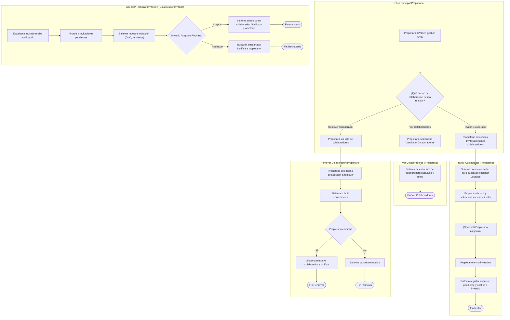
```mermaid
graph TD
    subgraph "Flujo Principal Propietario"
        A["Propietario OVC en gestión OVC"] --> B{¿Qué acción de colaboración desea realizar?}
        B -- "Invitar Colaborador" --> IC1["Propietario selecciona 'Invitar/Gestionar Colaboradores'"]
        B -- "Ver Colaboradores" --> VC1["Propietario selecciona 'Gestionar Colaboradores'"]
        B -- "Remover Colaborador" --> RC1["Propietario en lista de colaboradores"]
    end

    subgraph "Invitar Colaborador (Propietario)"
        IC1 --> IC2["Sistema presenta interfaz para buscar/seleccionar usuarios"]
        IC2 --> IC3["Propietario busca y selecciona usuario a invitar"]
        IC3 --> IC4["(Opcional) Propietario asigna rol"]
        IC4 --> IC5["Propietario envía invitación"]
        IC5 --> IC6["Sistema registra invitación pendiente y notifica a invitado"]
        IC6 --> FIN_IC([Fin Invitar])
    end

    subgraph "Aceptar/Rechazar Invitación (Colaborador Invitado)"
        AR1["Estudiante invitado recibe notificación"] --> AR2["Accede a invitaciones pendientes"]
        AR2 --> AR3["Sistema muestra invitación (OVC, remitente)"]
        AR3 --> AR4{Invitado Acepta o Rechaza}
        AR4 -- "Aceptar" --> AR5["Sistema añade como colaborador. Notifica a propietario."]
        AR5 --> FIN_AR_ACEPTA([Fin Aceptado])
        AR4 -- "Rechazar" --> AR6["Invitación descartada. Notifica a propietario."]
        AR6 --> FIN_AR_RECHAZA([Fin Rechazado])
    end

    subgraph "Ver Colaboradores (Propietario)"
        VC1 --> VC2["Sistema muestra lista de colaboradores actuales y roles"]
        VC2 --> FIN_VC([Fin Ver Colaboradores])
    end

    subgraph "Remover Colaborador (Propietario)"
        RC1 --> RC2["Propietario selecciona colaborador a remover"]
        RC2 --> RC3["Sistema solicita confirmación"]
        RC3 --> RC4{Propietario confirma}
        RC4 -- "Sí" --> RC5["Sistema remueve colaborador y notifica"]
        RC5 --> FIN_RC([Fin Remover])
        RC4 -- "No" --> RC6["Sistema cancela remoción"]
        RC6 --> FIN_RC_CANC([Fin Remover])
    end
```

**Explicación del Proceso:**
Este diagrama también se divide en subgrafos:
*   **Invitar Colaborador (realizado por el Propietario):**
    1.  El Propietario accede a la gestión de colaboradores e invita a un usuario.
    2.  Puede asignar un rol opcionalmente.
    3.  El Sistema envía la invitación y notifica al usuario invitado.
*   **Aceptar/Rechazar Invitación (realizado por el Colaborador invitado):**
    1.  El usuario invitado recibe la notificación y accede a la invitación.
    2.  Decide si aceptar o rechazar.
    3.  El Sistema actualiza el estado y notifica al propietario.
*   **Ver Colaboradores (realizado por el Propietario):**
    1.  El Propietario accede a la sección y el Sistema muestra la lista de colaboradores actuales.
*   **Remover Colaborador (realizado por el Propietario):**
    1.  El Propietario selecciona un colaborador de la lista para eliminarlo.
    2.  Tras la confirmación, el Sistema lo remueve y notifica al usuario afectado.

### UC-201: Diseñar Rúbrica

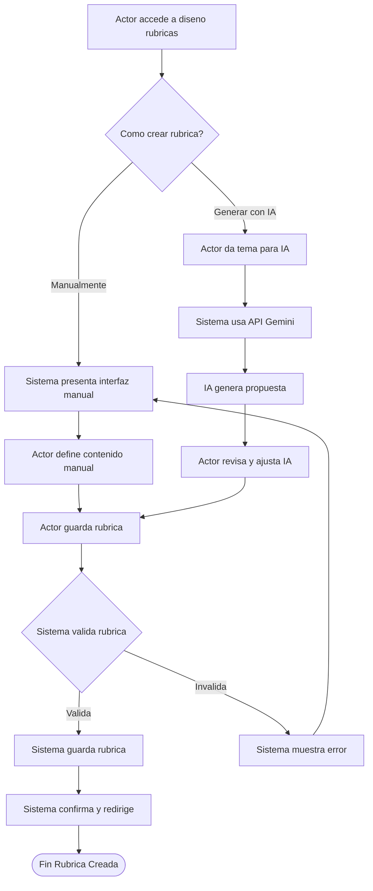
```mermaid
graph TD
    A["Actor accede a diseno rubricas"] --> B{Como crear rubrica?}
    B -- "Manualmente" --> C1["Sistema presenta interfaz manual"]
    B -- "Generar con IA" --> C2["Actor da tema para IA"]

    C1 --> D1["Actor define contenido manual"]
    D1 --> E["Actor guarda rubrica"]

    C2 --> D2["Sistema usa API Gemini"]
    D2 --> D3["IA genera propuesta"]
    D3 --> D4["Actor revisa y ajusta IA"]
    D4 --> E

    E --> F{Sistema valida rubrica}
    F -- "Valida" --> G["Sistema guarda rubrica"]
    G --> H["Sistema confirma y redirige"]
    H --> I([Fin Rubrica Creada])
    F -- "Invalida" --> J["Sistema muestra error"]
    J --> C1
```

**Explicación del Proceso:**
1.  Un **Actor** (Profesor o Administrador) accede a la funcionalidad para diseñar rúbricas.
2.  Tiene dos opciones:
    *   **Manualmente:** El Sistema presenta una interfaz para que el Actor defina todos los componentes de la rúbrica.
    *   **Generar con IA:** El Actor proporciona un tema o descripción. El Sistema usa una IA para generar una propuesta, que el Actor luego puede revisar y ajustar.
3.  Una vez que el Actor ha finalizado el diseño, guarda la rúbrica.
4.  El **Sistema** valida la rúbrica.
    *   Si es válida, la guarda y confirma la creación.
    *   Si no es válida, muestra un error para que el Actor la corrija.

### UC-202: Evaluar OVC Usando Rúbrica

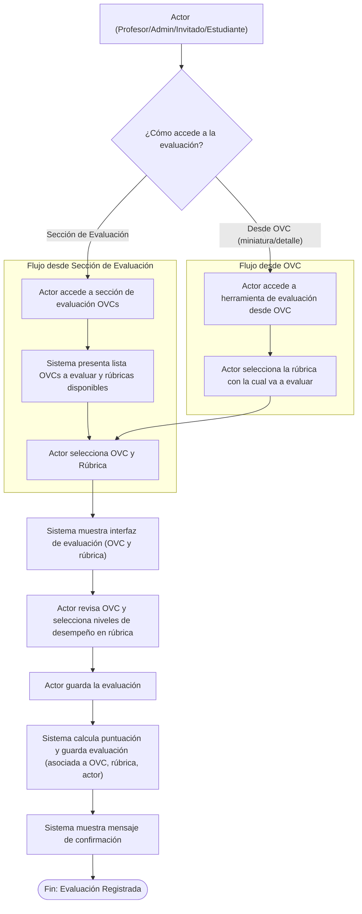
```mermaid
graph TD
    A["Actor (Profesor/Admin/Invitado/Estudiante)"] --> B{¿Cómo accede a la evaluación?}
    B -- "Sección de Evaluación" --> C1["Actor accede a sección de evaluación OVCs"]
    B -- "Desde OVC (miniatura/detalle)" --> C2["Actor accede a herramienta de evaluación desde OVC"]

    subgraph "Flujo desde Sección de Evaluación"
        C1 --> D1["Sistema presenta lista OVCs a evaluar y rúbricas disponibles"]
        D1 --> E["Actor selecciona OVC y Rúbrica"]
    end

    subgraph "Flujo desde OVC"
        C2 --> D2["Actor selecciona la rúbrica con la cual va a evaluar"]
        D2 --> E
    end

    E --> F["Sistema muestra interfaz de evaluación (OVC y rúbrica)"]
    F --> G["Actor revisa OVC y selecciona niveles de desempeño en rúbrica"]
    G --> H["Actor guarda la evaluación"]
    H --> I["Sistema calcula puntuación y guarda evaluación (asociada a OVC, rúbrica, actor)"]
    I --> J["Sistema muestra mensaje de confirmación"]
    J --> K([Fin: Evaluación Registrada])
```

**Explicación del Proceso:**
1.  Un **Actor** (Profesor, Administrador, Invitado o Estudiante para auto/heteroevaluación) desea evaluar un OVC.
2.  Puede iniciar el proceso de dos maneras:
    *   Accediendo a una sección general de evaluación de OVCs, donde el Sistema le mostrará los OVCs y rúbricas disponibles. El Actor selecciona el OVC y la rúbrica.
    *   Accediendo directamente desde la vista de un OVC (miniatura o detalle) a la herramienta de evaluación. En este caso, solo necesita seleccionar la rúbrica.
3.  Una vez seleccionado el OVC y la rúbrica, el **Sistema** muestra la interfaz de evaluación con el OVC (o un enlace a él) y la rúbrica.
4.  El **Actor** revisa el OVC y completa la rúbrica seleccionando los niveles de desempeño para cada criterio.
5.  El **Actor** guarda la evaluación.
6.  El **Sistema** calcula la puntuación, la guarda asociándola al OVC, la rúbrica y el evaluador.
7.  Finalmente, el **Sistema** muestra un mensaje de confirmación.

### UC-203: Ver Promedios de Evaluación de OVC

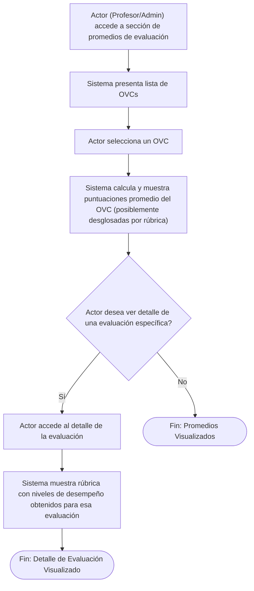
```mermaid
graph TD
    A["Actor (Profesor/Admin) accede a sección de promedios de evaluación"] --> B["Sistema presenta lista de OVCs"]
    B --> C["Actor selecciona un OVC"]
    C --> D["Sistema calcula y muestra puntuaciones promedio del OVC (posiblemente desglosadas por rúbrica)"]
    D --> E{Actor desea ver detalle de una evaluación específica?}
    E -- "Sí" --> F["Actor accede al detalle de la evaluación"]
    F --> G["Sistema muestra rúbrica con niveles de desempeño obtenidos para esa evaluación"]
    G --> H([Fin: Detalle de Evaluación Visualizado])
    E -- "No" --> I([Fin: Promedios Visualizados])
```

**Explicación del Proceso:**
1.  Un **Actor** (Profesor o Administrador) accede a la sección designada para ver los promedios de evaluación.
2.  El **Sistema** le presenta una lista de los OVCs.
3.  El **Actor** selecciona un OVC de la lista.
4.  El **Sistema** calcula y muestra las puntuaciones promedio para el OVC seleccionado. Esta información podría estar desglosada por cada rúbrica utilizada en las evaluaciones de ese OVC.
5.  Desde esta vista de promedios, el **Actor** tiene la opción de profundizar y ver el detalle de una evaluación específica.
    *   Si decide ver el detalle, el **Sistema** le mostrará la rúbrica completa con los niveles de desempeño que se marcaron en esa evaluación en particular.
    *   Si no desea ver más detalles, el proceso concluye con la visualización de los promedios.

### UC-204: Resumir Rúbricas

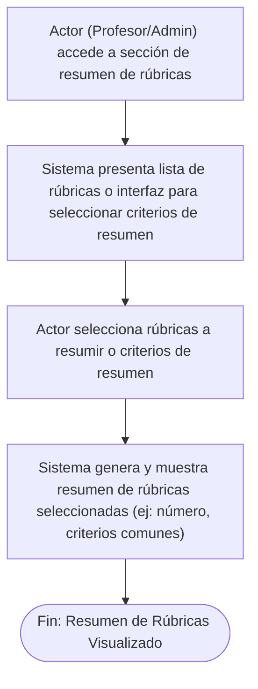
```mermaid
graph TD
    A["Actor (Profesor/Admin) accede a sección de resumen de rúbricas"] --> B["Sistema presenta lista de rúbricas o interfaz para seleccionar criterios de resumen"]
    B --> C["Actor selecciona rúbricas a resumir o criterios de resumen"]
    C --> D["Sistema genera y muestra resumen de rúbricas seleccionadas (ej: número, criterios comunes)"]
    D --> E([Fin: Resumen de Rúbricas Visualizado])
```

**Explicación del Proceso:**
1.  Un **Actor** (Profesor o Administrador) accede a la funcionalidad para resumir rúbricas.
2.  El **Sistema** le presenta una lista de las rúbricas existentes o una interfaz donde puede seleccionar criterios específicos para generar el resumen.
3.  El **Actor** selecciona las rúbricas que desea incluir en el resumen o define los criterios para el mismo.
4.  El **Sistema** procesa la solicitud y genera un resumen de las rúbricas seleccionadas. Este resumen podría incluir información como la cantidad de rúbricas, los criterios de evaluación más comunes entre ellas, etc.
5.  El **Sistema** muestra este resumen al Actor.

### UC-205: Ver Lista de Rúbricas

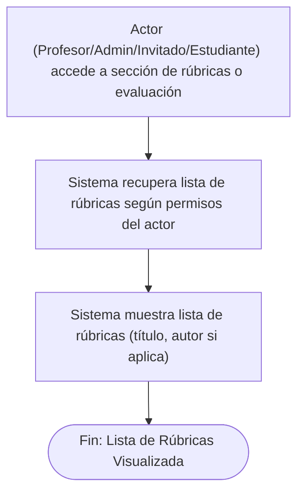
```mermaid
graph TD
    A["Actor (Profesor/Admin/Invitado/Estudiante) accede a sección de rúbricas o evaluación"] --> B["Sistema recupera lista de rúbricas según permisos del actor"]
    B --> C["Sistema muestra lista de rúbricas (título, autor si aplica)"]
    C --> D([Fin: Lista de Rúbricas Visualizada])
```

**Explicación del Proceso:**
1.  Un **Actor** (Profesor, Administrador, Invitado o Estudiante) accede a la sección donde se listan las rúbricas, ya sea directamente o como parte de un proceso de evaluación.
2.  El **Sistema** recupera la lista de rúbricas a las que el Actor tiene permiso de acceso.
3.  El **Sistema** muestra la lista de rúbricas, incluyendo información relevante como el título y, para roles con permiso, el autor de la rúbrica.

### UC-206: Ver Detalles de Rúbrica

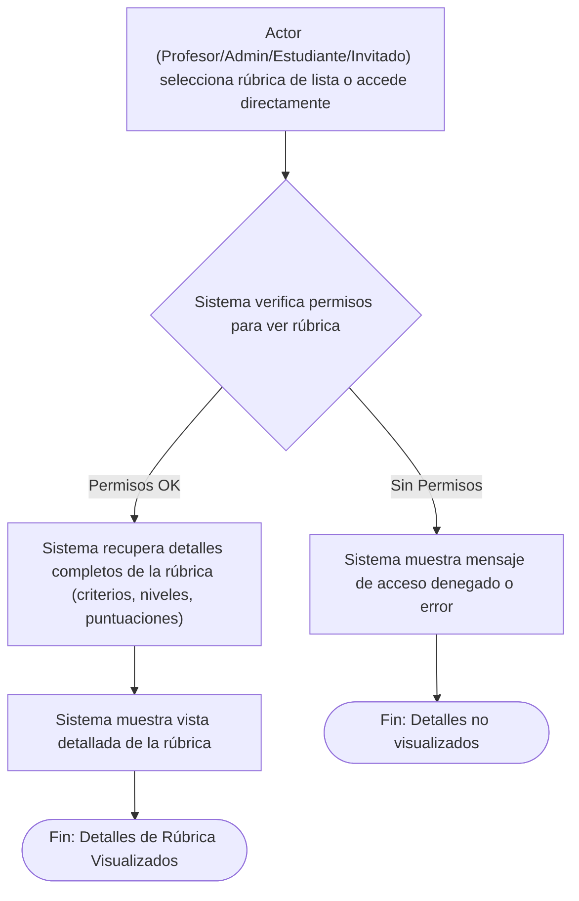
```mermaid
graph TD
    A["Actor (Profesor/Admin/Estudiante/Invitado) selecciona rúbrica de lista o accede directamente"] --> B{Sistema verifica permisos para ver rúbrica}
    B -- "Permisos OK" --> C["Sistema recupera detalles completos de la rúbrica (criterios, niveles, puntuaciones)"]
    C --> D["Sistema muestra vista detallada de la rúbrica"]
    D --> E([Fin: Detalles de Rúbrica Visualizados])
    B -- "Sin Permisos" --> F["Sistema muestra mensaje de acceso denegado o error"]
    F --> G([Fin: Detalles no visualizados])
```

**Explicación del Proceso:**
1.  Un **Actor** (Profesor, Administrador, Estudiante o Invitado) selecciona una rúbrica específica, ya sea desde una lista o accediendo a ella directamente.
2.  El **Sistema** verifica si el Actor tiene los permisos necesarios para ver los detalles de esa rúbrica.
3.  Si el Actor tiene permiso, el **Sistema** recupera toda la información detallada de la rúbrica.
4.  Luego, el **Sistema** presenta esta información detallada al Actor.
5.  Si el Actor no tiene los permisos requeridos, el **Sistema** muestra un mensaje indicando que el acceso está denegado o que ha ocurrido un error.

### UC-207: Eliminar Rúbrica

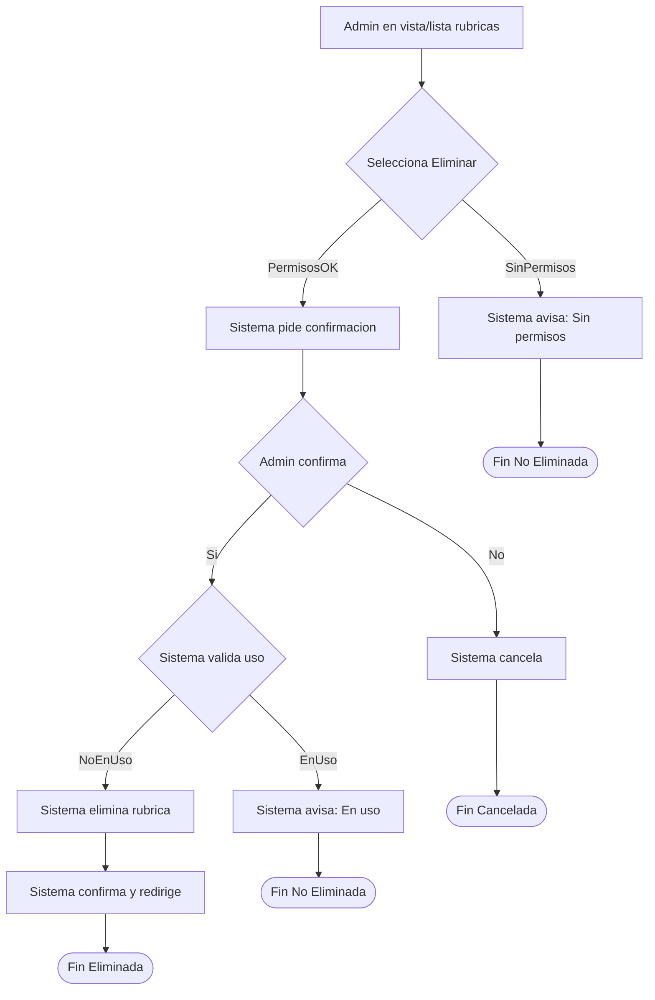
```mermaid
graph TD
    A["Admin en vista/lista rubricas"] --> B{Selecciona Eliminar}
    B -- PermisosOK --> C["Sistema pide confirmacion"]
    C --> D{Admin confirma}
    D -- Si --> E{Sistema valida uso}
    E -- NoEnUso --> F["Sistema elimina rubrica"]
    F --> G["Sistema confirma y redirige"]
    G --> H([Fin Eliminada])
    E -- EnUso --> J["Sistema avisa: En uso"]
    J --> K([Fin No Eliminada])
    D -- No --> L["Sistema cancela"]
    L --> M([Fin Cancelada])
    B -- SinPermisos --> N["Sistema avisa: Sin permisos"]
    N --> O([Fin No Eliminada])
```

**Explicación del Proceso:**
1.  Un **Administrador** está viendo los detalles de una rúbrica o una lista de rúbricas y selecciona la opción para eliminar una rúbrica específica.
2.  El **Sistema** verifica si el Administrador tiene los permisos necesarios para eliminar rúbricas.
3.  Si tiene permisos, el **Sistema** pide una confirmación antes de proceder.
4.  El **Administrador** confirma que desea eliminar la rúbrica.
    *   Si confirma, el **Sistema** primero valida que la rúbrica no esté siendo utilizada actualmente en ninguna evaluación registrada.
        *   Si la rúbrica no está en uso, el **Sistema** la elimina. Luego, muestra un mensaje de confirmación y redirige al Administrador a la lista de rúbricas.
        *   Si la rúbrica está en uso, el **Sistema** muestra un mensaje indicando que no se puede eliminar y la operación se cancela.
    *   Si el Administrador cancela la eliminación en el paso de confirmación, el **Sistema** no realiza ninguna acción.
5.  Si el Administrador no tenía permisos para eliminar inicialmente, el **Sistema** muestra un mensaje indicándolo.

### UC-208: Realizar Evaluación como Invitado

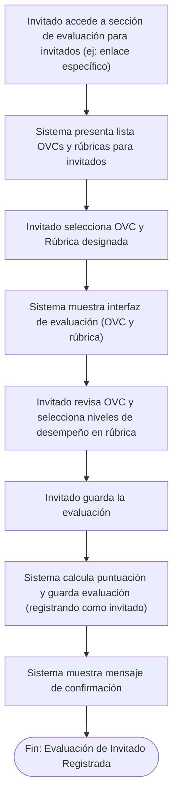
```mermaid
graph TD
    A["Invitado accede a sección de evaluación para invitados (ej: enlace específico)"] --> B["Sistema presenta lista OVCs y rúbricas para invitados"]
    B --> C["Invitado selecciona OVC y Rúbrica designada"]
    C --> D["Sistema muestra interfaz de evaluación (OVC y rúbrica)"]
    D --> E["Invitado revisa OVC y selecciona niveles de desempeño en rúbrica"]
    E --> F["Invitado guarda la evaluación"]
    F --> G["Sistema calcula puntuación y guarda evaluación (registrando como invitado)"]
    G --> H["Sistema muestra mensaje de confirmación"]
    H --> I([Fin: Evaluación de Invitado Registrada])
```

**Explicación del Proceso:**
1.  Un **Invitado** accede al sistema para realizar una evaluación, posiblemente a través de un enlace público o una sección específica para invitados.
2.  El **Sistema** le presenta una lista de OVCs que están disponibles para ser evaluados por invitados, junto con las rúbricas designadas para este propósito.
3.  El **Invitado** selecciona un OVC y la rúbrica correspondiente.
4.  El **Sistema** muestra la interfaz de evaluación, que incluye el OVC (o un enlace a él) y la rúbrica seleccionada.
5.  El **Invitado** revisa el OVC y completa la rúbrica marcando los niveles de desempeño para cada criterio.
6.  El **Invitado** guarda la evaluación.
7.  El **Sistema** calcula la puntuación y guarda la evaluación, asegurándose de registrar que fue realizada por un invitado.
8.  Finalmente, el **Sistema** muestra un mensaje de confirmación al Invitado.

### UC-301: Usar Tablero Kanban

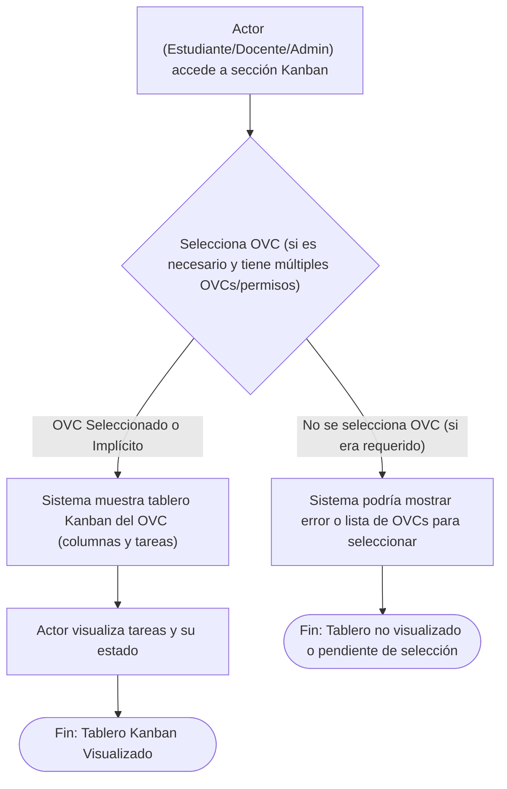
```mermaid
graph TD
    A["Actor (Estudiante/Docente/Admin) accede a sección Kanban"] --> B{"Selecciona OVC (si es necesario y tiene múltiples OVCs/permisos)"}
    B -- "OVC Seleccionado o Implícito" --> C["Sistema muestra tablero Kanban del OVC (columnas y tareas)"]
    C --> D["Actor visualiza tareas y su estado"]
    D --> E([Fin: Tablero Kanban Visualizado])
    B -- "No se selecciona OVC (si era requerido)" --> F["Sistema podría mostrar error o lista de OVCs para seleccionar"]
    F --> G([Fin: Tablero no visualizado o pendiente de selección])
```

**Explicación del Proceso:**
1.  Un **Actor** (Estudiante, Docente o Administrador) accede a la funcionalidad del tablero Kanban.
2.  Si el Actor tiene acceso a múltiples OVCs, el **Sistema** podría requerir que seleccione el OVC específico.
3.  Una vez que el OVC está determinado, el **Sistema** muestra el tablero Kanban asociado.
4.  El **Actor** puede entonces visualizar las tareas y su estado actual en el tablero.
5.  Si se requería seleccionar un OVC y no se hizo, el sistema podría mostrar un error.

### UC-302: Gestionar Tareas en Kanban

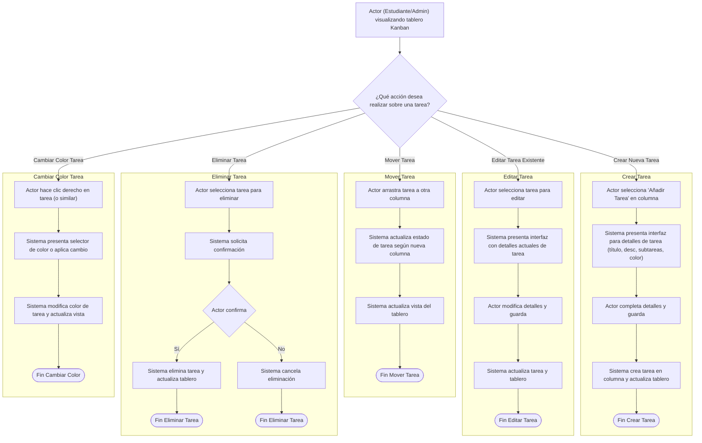
```mermaid
graph TD
    A["Actor (Estudiante/Admin) visualizando tablero Kanban"] --> B{¿Qué acción desea realizar sobre una tarea?}
    B -- "Crear Nueva Tarea" --> CT1["Actor selecciona 'Añadir Tarea' en columna"]
    B -- "Editar Tarea Existente" --> ET1["Actor selecciona tarea para editar"]
    B -- "Mover Tarea" --> MT1["Actor arrastra tarea a otra columna"]
    B -- "Eliminar Tarea" --> DT1["Actor selecciona tarea para eliminar"]
    B -- "Cambiar Color Tarea" --> CCT1["Actor hace clic derecho en tarea (o similar)"]

    subgraph "Crear Tarea"
        CT1 --> CT2["Sistema presenta interfaz para detalles de tarea (título, desc, subtareas, color)"]
        CT2 --> CT3["Actor completa detalles y guarda"]
        CT3 --> CT4["Sistema crea tarea en columna y actualiza tablero"]
        CT4 --> FIN_CT([Fin Crear Tarea])
    end

    subgraph "Editar Tarea"
        ET1 --> ET2["Sistema presenta interfaz con detalles actuales de tarea"]
        ET2 --> ET3["Actor modifica detalles y guarda"]
        ET3 --> ET4["Sistema actualiza tarea y tablero"]
        ET4 --> FIN_ET([Fin Editar Tarea])
    end

    subgraph "Mover Tarea"
        MT1 --> MT2["Sistema actualiza estado de tarea según nueva columna"]
        MT2 --> MT3["Sistema actualiza vista del tablero"]
        MT3 --> FIN_MT([Fin Mover Tarea])
    end

    subgraph "Eliminar Tarea"
        DT1 --> DT2["Sistema solicita confirmación"]
        DT2 --> DT3{Actor confirma}
        DT3 -- "Sí" --> DT4["Sistema elimina tarea y actualiza tablero"]
        DT4 --> FIN_DT([Fin Eliminar Tarea])
        DT3 -- "No" --> DT5["Sistema cancela eliminación"]
        DT5 --> FIN_DT_CANC([Fin Eliminar Tarea])
    end

    subgraph "Cambiar Color Tarea"
        CCT1 --> CCT2["Sistema presenta selector de color o aplica cambio"]
        CCT2 --> CCT3["Sistema modifica color de tarea y actualiza vista"]
        CCT3 --> FIN_CCT([Fin Cambiar Color])
    end
```

**Explicación del Proceso:**
Un **Actor** (Estudiante o Administrador con permisos) está en el tablero Kanban y decide realizar una acción sobre las tareas:
*   **Crear Tarea:** Selecciona añadir tarea, completa detalles, guarda; Sistema crea y actualiza.
*   **Editar Tarea:** Selecciona tarea, modifica detalles, guarda; Sistema actualiza.
*   **Mover Tarea:** Arrastra tarea; Sistema actualiza estado y vista.
*   **Eliminar Tarea:** Selecciona tarea, confirma; Sistema elimina y actualiza.
*   **Cambiar Color Tarea:** Realiza acción, selecciona color; Sistema actualiza.

### UC-303: Visualizar Tareas Propias en Kanban

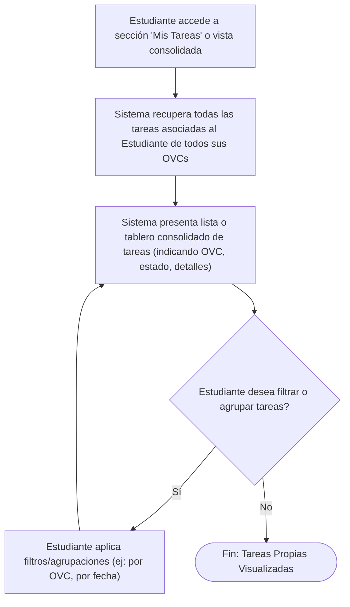
```mermaid
graph TD
    A["Estudiante accede a sección 'Mis Tareas' o vista consolidada"] --> B["Sistema recupera todas las tareas asociadas al Estudiante de todos sus OVCs"]
    B --> C["Sistema presenta lista o tablero consolidado de tareas (indicando OVC, estado, detalles)"]
    C --> D{Estudiante desea filtrar o agrupar tareas?}
    D -- "Sí" --> E["Estudiante aplica filtros/agrupaciones (ej: por OVC, por fecha)"]
    E --> C
    D -- "No" --> F([Fin: Tareas Propias Visualizadas])
```

**Explicación del Proceso:**
1.  Un **Estudiante** accede a una sección como "Mis Tareas".
2.  El **Sistema** recupera todas las tareas del Estudiante de todos sus OVCs.
3.  El **Sistema** presenta estas tareas en una vista consolidada.
4.  El **Estudiante** puede filtrar o agrupar las tareas. Si lo hace, la vista se actualiza.

### UC-304: Ver Visualización Rizoma

```mermaid
graph TD
    A["Actor (Estudiante/Profesor/Admin) accede a sección de visualización Rizoma"] --> B["Sistema recupera datos de OVCs y sus relaciones"]
    B --> C["Sistema genera y muestra visualización interactiva del Rizoma"]
    C --> D{Actor interactúa con la visualización (zoom, pan, hover para detalles)}
    D -- "Selecciona OVC en Rizoma" --> E["Sistema muestra previsualización o redirige a detalles del OVC seleccionado"]
    E --> C
    D -- "Termina interacción" --> F([Fin: Visualización Rizoma Terminada])
```

**Explicación del Proceso:**
1.  Un **Actor** accede a la visualización del Rizoma.
2.  El **Sistema** recupera datos de OVCs y relaciones.
3.  El **Sistema** genera y muestra la visualización interactiva.
4.  El **Actor** puede interactuar (zoom, pan, hover, seleccionar OVC para ver detalles/previsualización y volver al Rizoma).
5.  El proceso concluye cuando el Actor termina la interacción.

### UC-401: Ver Foro de OVC

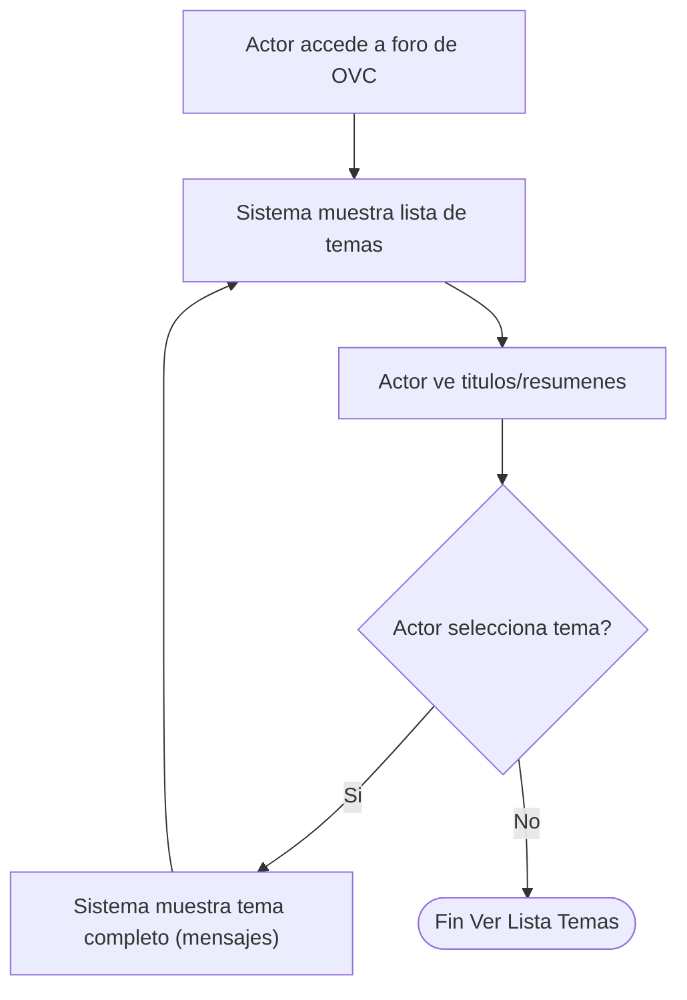
```mermaid
graph TD
    A["Actor accede a foro de OVC"] --> B["Sistema muestra lista de temas"]
    B --> C["Actor ve titulos/resumenes"]
    C --> D{Actor selecciona tema?}
    D -- "Si" --> E["Sistema muestra tema completo (mensajes)"]
    E --> B
    D -- "No" --> F([Fin Ver Lista Temas])
```

**Explicación del Proceso:**
1.  Un **Actor** accede al foro de un OVC.
2.  El **Sistema** muestra la lista de temas de discusión.
3.  El **Actor** ve títulos y resúmenes.
4.  Si el **Actor** selecciona un tema, el Sistema lo muestra completo. Luego puede volver a la lista de temas.
5.  Si no selecciona un tema para ver en detalle, concluye la visualización de la lista.

### UC-402: Crear Tema en Foro

```mermaid
graph TD
    A["Actor (Estudiante/Profesor/Admin) visualizando foro de OVC"] --> B["Selecciona opción 'Crear Nuevo Tema'"]
    B --> C["Sistema presenta formulario para título y contenido del primer mensaje"]
    C --> D["Actor completa formulario y envía"]
    D --> E["Sistema crea nuevo tema en foro del OVC con el primer mensaje asociado al Actor"]
    E --> F["Sistema muestra el nuevo tema en la lista de temas del foro"]
    F --> G([Fin: Nuevo Tema Creado])
```

**Explicación del Proceso:**
1.  Un **Actor** en el foro de un OVC selecciona 'Crear Nuevo Tema'.
2.  El **Sistema** presenta un formulario para título y primer mensaje.
3.  El **Actor** completa y envía.
4.  El **Sistema** crea el tema con el mensaje.
5.  El **Sistema** muestra el nuevo tema en la lista.

### UC-403: Crear Mensaje en Tema de Foro

```mermaid
graph TD
    A["Actor (Estudiante/Profesor/Admin) visualizando un tema de discusión"] --> B["Accede a sección para añadir nuevo mensaje (ej: campo de respuesta)"]
    B --> C["Sistema presenta área de texto para ingresar contenido del mensaje"]
    C --> D["Actor escribe su mensaje y lo envía"]
    D --> E["Sistema crea nuevo mensaje y lo añade al tema de discusión, asociado al Actor"]
    E --> F["Sistema actualiza vista del tema para incluir nuevo mensaje"]
    F --> G([Fin: Nuevo Mensaje Creado])
```

**Explicación del Proceso:**
1.  Un **Actor** viendo un tema accede para añadir un mensaje.
2.  El **Sistema** presenta un área de texto.
3.  El **Actor** escribe y envía el mensaje.
4.  El **Sistema** crea y añade el mensaje al tema.
5.  El **Sistema** actualiza la vista del tema.

### UC-404: Moderar Foro (Eliminar Temas/Mensajes)

```mermaid
graph TD
    A["Administrador visualizando foro, tema o mensaje"] --> B{¿Qué desea moderar?}
    B -- "Eliminar Tema Completo" --> ET1["Admin selecciona un tema para eliminar"]
    B -- "Eliminar Mensaje Específico" --> EM1["Admin selecciona un mensaje específico para eliminar"]

    subgraph "Eliminar Tema"
        ET1 --> ET2["Sistema solicita confirmación para eliminar tema y todos sus mensajes"]
        ET2 --> ET3{Admin confirma eliminación de tema}
        ET3 -- "Sí" --> ET4["Sistema elimina tema y mensajes asociados"]
        ET4 --> ET5["Sistema actualiza vista del foro"]
        ET5 --> FIN_ET([Fin: Tema Eliminado])
        ET3 -- "No" --> ET6["Sistema cancela eliminación de tema"]
        ET6 --> FIN_ET_CANC([Fin: Tema No Eliminado])
    end

    subgraph "Eliminar Mensaje"
        EM1 --> EM2["Sistema solicita confirmación para eliminar mensaje"]
        EM2 --> EM3{Admin confirma eliminación de mensaje}
        EM3 -- "Sí" --> EM4["Sistema elimina el mensaje del tema"]
        EM4 --> EM5["Sistema actualiza vista del tema"]
        EM5 --> FIN_EM([Fin: Mensaje Eliminado])
        EM3 -- "No" --> EM6["Sistema cancela eliminación de mensaje"]
        EM6 --> FIN_EM_CANC([Fin: Mensaje No Eliminado])
    end
```

**Explicación del Proceso:**
Un **Administrador** modera el foro:
*   **Eliminar Tema:** Selecciona tema, confirma; Sistema elimina tema y mensajes, actualiza vista.
*   **Eliminar Mensaje:** Selecciona mensaje, confirma; Sistema elimina mensaje, actualiza vista.

### UC-501: Gestionar Usuarios

```mermaid
graph TD
    A["Admin accede a gestion de usuarios"] --> B{Que accion desea realizar?}
    B -- "Crear Usuario" --> CU1["Admin selecciona 'Crear Usuario'"]
    B -- "Editar Usuario" --> EU1["Admin selecciona usuario de lista para editar"]
    B -- "Eliminar Usuario" --> DU1["Admin selecciona usuario de lista para eliminar"]

    subgraph "Crear Usuario"
        CU1 --> CU2["Sistema presenta formulario (nombre, email, rol, etc)"]
        CU2 --> CU3["Admin completa datos y guarda"]
        CU3 --> CU4{Sistema valida datos}
        CU4 -- Valido --> CU5["Sistema crea usuario y notifica (opcional)"]
        CU5 --> CU6["Sistema actualiza lista de usuarios"]
        CU6 --> FIN_CU([Fin Crear Usuario])
        CU4 -- Invalido --> CU7["Sistema muestra error"]
        CU7 --> CU2
    end

    subgraph "Editar Usuario"
        EU1 --> EU2["Sistema presenta formulario con datos actuales del usuario"]
        EU2 --> EU3["Admin modifica datos y guarda"]
        EU3 --> EU4{Sistema valida datos}
        EU4 -- Valido --> EU5["Sistema actualiza datos del usuario"]
        EU5 --> EU6["Sistema actualiza lista de usuarios"]
        EU6 --> FIN_EU([Fin Editar Usuario])
        EU4 -- Invalido --> EU7["Sistema muestra error"]
        EU7 --> EU2
    end

    subgraph "Eliminar Usuario"
        DU1 --> DU2["Sistema solicita confirmacion para eliminar usuario"]
        DU2 --> DU3{Admin confirma eliminacion}
        DU3 -- Si --> DU4["Sistema elimina usuario (y datos asociados segun politica)"]
        DU4 --> DU5["Sistema actualiza lista de usuarios"]
        DU5 --> FIN_DU([Fin Eliminar Usuario])
        DU3 -- No --> DU6["Sistema cancela eliminacion"]
        DU6 --> FIN_DU_CANC([Fin Eliminar Usuario])
    end
```

**Explicación del Proceso:**
Un **Administrador** gestiona usuarios:
*   **Crear Usuario:** Selecciona crear, completa formulario, guarda; Sistema valida, crea, actualiza lista.
*   **Editar Usuario:** Selecciona usuario, modifica datos, guarda; Sistema valida, actualiza, actualiza lista.
*   **Eliminar Usuario:** Selecciona usuario, confirma; Sistema elimina, actualiza lista.

### UC-601: Recibir Notificaciones

```mermaid
graph TD
    A["Sistema detecta un evento relevante para un Actor"] --> B["Evento (ej: Nueva invitación colaboración, OVC aprobado/rechazado, Nuevo mensaje en foro seguido, etc.)"]
    B --> C["Sistema identifica al Actor(es) que debe(n) ser notificado(s)"]
    C --> D{"¿Cómo se entrega la notificación?"}
    D -- "Notificación en la interfaz del sistema" --> E1["Sistema muestra indicador de notificación (ej: ícono, contador)"]
    E1 --> F1["Actor accede a su panel/centro de notificaciones"]
    F1 --> G1["Sistema muestra lista de notificaciones con detalles y enlaces (si aplica)"]
    G1 --> H1([Fin: Actor visualiza notificación en UI])

    D -- "Notificación por Email (si configurado y aplica)" --> E2["Sistema envía email al Actor con detalles de la notificación"]
    E2 --> H2([Fin: Actor recibe notificación por email])

    D -- "Otra vía (ej: Push notification en app móvil - si existiera)" --> E3["Sistema envía notificación por otra vía configurada"]
    E3 --> H3([Fin: Actor recibe notificación por otra vía])

    G1 -- "Actor hace clic en notificación" --> I["Sistema redirige a contenido relevante (ej: OVC, foro, invitación)"]
    I --> J([Fin: Actor interactúa con contenido notificado])
```

**Explicación del Proceso:**
1.  El **Sistema** detecta un evento relevante.
2.  El **Sistema** identifica a los Actores a notificar.
3.  El **Sistema** entrega la notificación por la vía configurada (UI, email, otra).
4.  El **Actor** recibe y visualiza la notificación.
5.  El **Actor** puede interactuar con la notificación (ej. clic para ir al contenido).

---