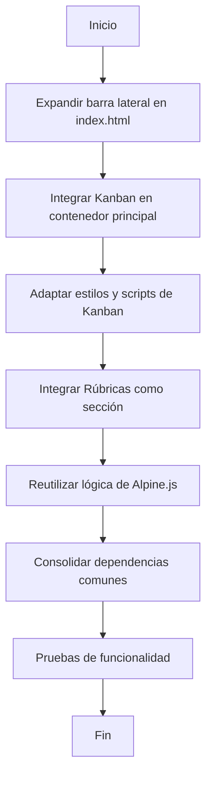

# Plan de Fusión de Aplicaciones HTML: OVC, Kanban y Rúbricas

## Objetivo

Consolidar las funcionalidades de `kamban.html` y `rubrics.html` dentro de la aplicación principal `index.html`, tratando las aplicaciones secundarias como módulos integrados.

## Archivos Involucrados

- **`index.html`**: Aplicación principal (OVC), contenedor final.
- **`kamban.html`**: Módulo Kanban.
- **`rubrics.html`**: Módulo de Rúbricas.

## Estrategia

### 1. Estructura General
- Expandir la barra lateral de `index.html` para incluir enlaces a "Tablero Kanban" y "Rúbricas".
- Crear contenedores dinámicos en el área principal para cargar las funcionalidades de Kanban y Rúbricas.

### 2. Integración de `kamban.html`
- Migrar el HTML del tablero Kanban al contenedor principal de `index.html`.
- Adaptar estilos y scripts para evitar conflictos (e.g., clases CSS y dependencias como SortableJS).
- Añadir un botón en la barra lateral para acceder al tablero Kanban.

### 3. Integración de `rubrics.html`
- Incorporar las pestañas de rúbricas como una sección dentro de `index.html`.
- Reutilizar Alpine.js para manejar la lógica interactiva.
- Ajustar estilos y dependencias para evitar conflictos.

### 4. Optimización de Recursos
- Consolidar dependencias comunes (e.g., TailwindCSS, Alpine.js).
- Eliminar duplicados de estilos y scripts.

### 5. Pruebas
- Verificar que las funcionalidades de cada módulo (OVC, Kanban, Rúbricas) operen correctamente.
- Asegurar que la navegación entre secciones sea fluida.

## Diagrama de Flujo

## Próximos Pasos
- Implementar el plan en `index.html`.
- Realizar pruebas exhaustivas para garantizar la funcionalidad integrada.