# Documento de Casos de Uso - SGOVC

## 1. Introducción

Este documento describe los casos de uso para el Sistema de Gestión de Objetos Virtuales Creativos (SGOVC), una aplicación diseñada para apoyar el proceso de creación, gestión y evaluación de OVCs en el contexto del Pregrado de en  Creación Digital de la Universidad de Antioquia. El sistema facilita la interacción entre estudiantes, profesores, administradores e invitados, proporcionando herramientas para la gestión de OVC, la gestión de estos como proyectos (Kanban), visualización de relacionesentre OVC (Rizoma), comunicación (Foro), y un sistema robusto de evaluación basado en rúbricas.

## 2. Actores

Los actores principales que interactúan con el sistema son:

*   **Estudiante:** Usuario que crea y gestiona sus propios Objetos Virtuales Creativos (OVCs), utiliza el tablero Kanban para el seguimiento de su proyecto, visualiza el Rizoma, participa en los foros asociados a los OVCs, ve sus evaluaciones, se evalúa a sí mismo o a sus compañeros (Evaluación 360 multi-rúbrica).Tiene visibilidad sobre todos los OVC y capacidad de edición en los propios.

*   **Profesor:** Usuario que Crea sus propios OVC (que en su caso pueden ser usados como recursos didácticos), supervisa el proceso de creación de OVCs, diseña y utiliza rúbricas para la evaluación, visualiza promedios de evaluación, crea  rúbricas, visualiza el Rizoma y participa en los foros. Tiene visibilidad sobre todos los OVCs.

*   **Administrador:** Usuario con control total sobre todas las funcionalidades del sistema, incluyendo la gestión de usuarios, OVCs, rúbricas, evaluaciones, tableros Kanban y foros.

*   **Invitado:** Usuario externo que puede visualizar los OVCs públicos y participar en el proceso de evaluación utilizando rúbricas designadas para invitados y participar en los foros.

## 3. Casos de Uso

### 3.1. Gestión de OVCs

**UC-101: Crear OVC**

*   **Goal:** El Estudiante desea registrar un nuevo Objeto Virtual Creativo en el sistema.
*   **Actor(s):** Estudiante
*   **Preconditions:** El Estudiante ha iniciado sesión en el sistema.
*   **Flow of Events:**
    *   **Basic Flow:**
        1.  El Estudiante accede a la sección de creación de OVCs.
        2.  El sistema presenta un formulario para ingresar los detalles del OVC (título, descripción, archivos, etc.).
        3.  El Estudiante completa el formulario con los detalles del OVC.
        4.  El sistema solicita al Estudiante seleccionar el nivel de visibilidad para el OVC (ej. Privado, Miembros del Curso, Institucional, Público).
        5.  El Estudiante selecciona el nivel de visibilidad y envía la información completa.
        6.  El sistema valida los datos y crea el nuevo OVC asociado al Estudiante con el nivel de visibilidad especificado.
        7.  El sistema muestra un mensaje de confirmación y redirige al Estudiante a la vista de su OVC recién creado o a la lista de sus OVCs o al rizoma filtrando su propio OVC y sus relaciones.
*   **Postconditions:** Se ha creado un nuevo OVC en el sistema, asociado al Estudiante y con un nivel de visibilidad definido.

**Diagrama de Flujo para UC-101 (Mermaid):**

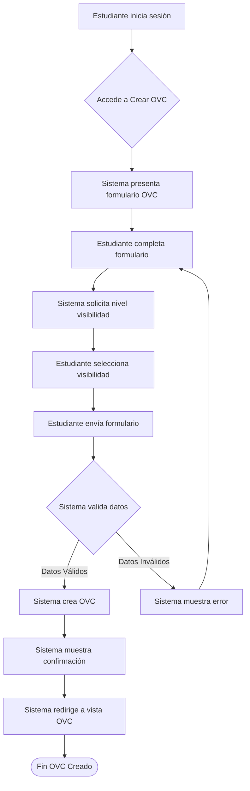
```mermaid
graph TD
    A["Estudiante inicia sesión"] --> B{"Accede a Crear OVC"}
    B --> C["Sistema presenta formulario OVC"]
    C --> D["Estudiante completa formulario"]
    D --> E["Sistema solicita nivel visibilidad"]
    E --> F["Estudiante selecciona visibilidad"]
    F --> G["Estudiante envía formulario"]
    G --> H{"Sistema valida datos"}
    H -- "Datos Válidos" --> I["Sistema crea OVC"]
    I --> J["Sistema muestra confirmación"]
    J --> K["Sistema redirige a vista OVC"]
    K --> L(["Fin OVC Creado"])
    H -- "Datos Inválidos" --> M["Sistema muestra error"]
    M --> D
```

**UC-102: Ver Lista de OVCs**

*   **Goal:** Un Actor desea visualizar la lista de OVCs disponibles en el sistema.
*   **Actor(s):** Estudiante, Profesor, Administrador, Invitado
*   **Preconditions:** El Actor ha accedido a la sección de OVCs.
*   **Flow of Events:**
    *   **Basic Flow:**
        1.  El Actor accede a la sección de OVCs.
        2.  El sistema recupera la lista de OVCs a los que el Actor tiene permiso de acceso (Estudiante: todos; Profesor, Administrador, Invitado: todos).
        3.  El sistema muestra la lista de OVCs, incluyendo información relevante como título, autor (para roles con permiso), y posiblemente una breve descripción o miniatura.
*   **Postconditions:** El Actor puede visualizar la lista de OVCs según sus permisos.

**Diagrama de Flujo para UC-102 (Mermaid):**

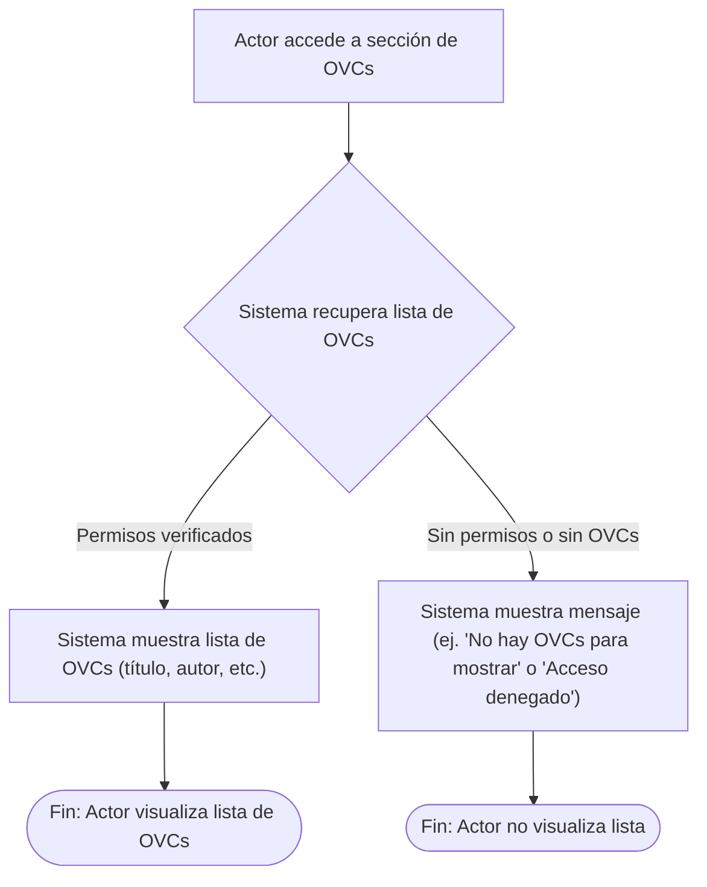
```mermaid
graph TD
    A["Actor accede a sección de OVCs"] --> B{"Sistema recupera lista de OVCs"}
    B -- "Permisos verificados" --> C["Sistema muestra lista de OVCs (título, autor, etc.)"]
    C --> D(["Fin: Actor visualiza lista de OVCs"])
    B -- "Sin permisos o sin OVCs" --> E["Sistema muestra mensaje (ej. 'No hay OVCs para mostrar' o 'Acceso denegado')"]
    E --> F(["Fin: Actor no visualiza lista"])
```

**UC-103: Ver Detalles de OVC**

*   **Goal:** Un Actor desea ver la información detallada de un OVC específico.
*   **Actor(s):** Estudiante, Profesor, Administrador, Invitado
*   **Preconditions:** El Actor está visualizando una lista de OVCs o tiene acceso directo a un OVC. El Actor tiene permisos para ver el OVC.
*   **Flow of Events:**
    *   **Basic Flow:**
        1.  El Actor selecciona un OVC de la lista o accede a él directamente.
        2.  El sistema recupera los detalles completos del OVC seleccionado (descripción, archivos adjuntos, metadatos, etc.).
        3.  El sistema muestra la vista detallada del OVC.
*   **Postconditions:** El Actor puede visualizar toda la información detallada del OVC.

**Diagrama de Flujo para UC-103 (Mermaid):**

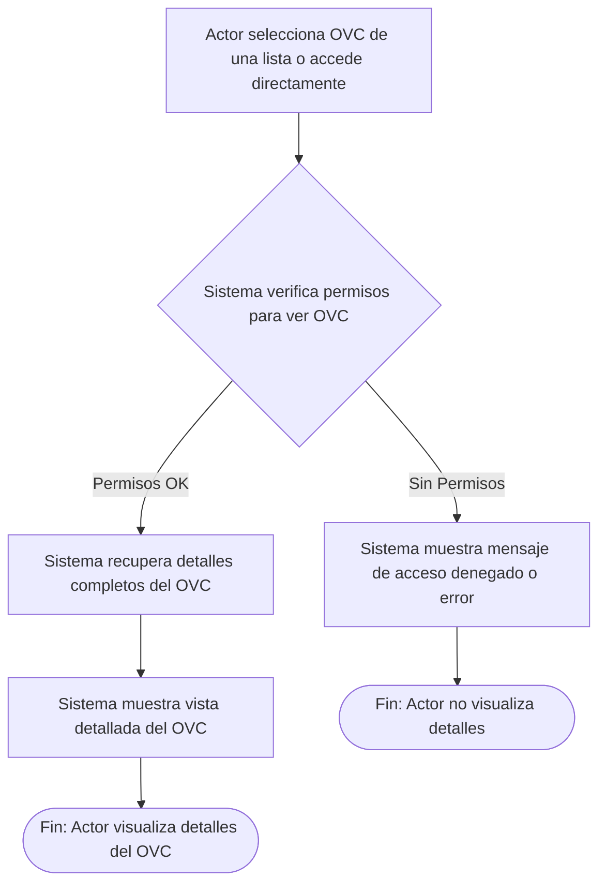
```mermaid
graph TD
    A["Actor selecciona OVC de una lista o accede directamente"] --> B{Sistema verifica permisos para ver OVC}
    B -- "Permisos OK" --> C["Sistema recupera detalles completos del OVC"]
    C --> D["Sistema muestra vista detallada del OVC"]
    D --> E(["Fin: Actor visualiza detalles del OVC"])
    B -- "Sin Permisos" --> F["Sistema muestra mensaje de acceso denegado o error"]
    F --> G(["Fin: Actor no visualiza detalles"])
```

**UC-104: Editar OVC**

*   **Goal:** Un Actor desea modificar la información de un OVC existente.
*   **Actor(s):** Estudiante, Administrador
*   **Preconditions:** El Actor ha iniciado sesión y tiene permisos para editar el OVC (Estudiante: propio; Administrador: cualquiera). El Actor está visualizando los detalles del OVC.
*   **Flow of Events:**
    *   **Basic Flow:**
        1.  El Actor, desde la vista de detalles del OVC, selecciona la opción de editar.
        2.  El sistema presenta un formulario pre-llenado con la información actual del OVC, incluyendo su configuración de visibilidad.
        3.  El Actor realiza las modificaciones necesarias en el formulario, pudiendo cambiar el título, descripción, archivos, y también el nivel de visibilidad del OVC.
        4.  El Actor guarda los cambios.
        5.  El sistema valida los datos y actualiza la información del OVC, incluyendo su nivel de visibilidad.
        6.  El sistema muestra un mensaje de confirmación y redirige a la vista de detalles del OVC actualizado.
*   **Postconditions:** La información del OVC, incluyendo su nivel de visibilidad, ha sido actualizada en el sistema.

**Diagrama de Flujo para UC-104 (Mermaid):**

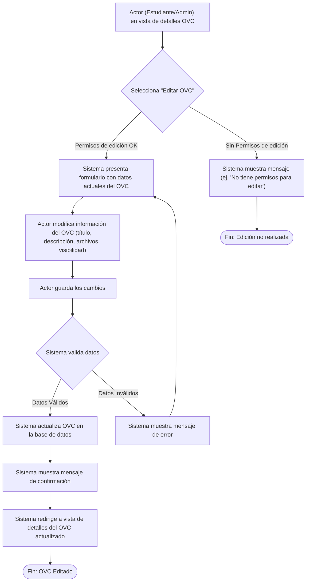
```mermaid
graph TD
    A["Actor (Estudiante/Admin) en vista de detalles OVC"] --> B{Selecciona &quot;Editar OVC&quot;}
    B -- "Permisos de edición OK" --> C["Sistema presenta formulario con datos actuales del OVC"]
    C --> D["Actor modifica información del OVC (título, descripción, archivos, visibilidad)"]
    D --> E["Actor guarda los cambios"]
    E --> F{Sistema valida datos}
    F -- "Datos Válidos" --> G["Sistema actualiza OVC en la base de datos"]
    G --> H["Sistema muestra mensaje de confirmación"]
    H --> I["Sistema redirige a vista de detalles del OVC actualizado"]
    I --> J(["Fin: OVC Editado"])
    F -- "Datos Inválidos" --> K["Sistema muestra mensaje de error"]
    K --> C
    B -- "Sin Permisos de edición" --> L["Sistema muestra mensaje (ej. 'No tiene permisos para editar')"]
    L --> M(["Fin: Edición no realizada"])
```

**UC-105: Eliminar OVC**

*   **Goal:** El Administrador desea eliminar un OVC del sistema.
*   **Actor(s):** Administrador
*   **Preconditions:** El Administrador ha iniciado sesión y tiene permisos para eliminar el OVC. El Administrador está visualizando los detalles del OVC o una lista de OVCs.
*   **Flow of Events:**
    *   **Basic Flow:**
        1.  El Administrador selecciona la opción de eliminar para un OVC específico.
        2.  El sistema solicita confirmación para la eliminación.
        3.  El Administrador confirma la eliminación.
        4.  El sistema elimina el OVC y toda la información asociada (evaluaciones, tareas de Kanban, temas de foro relacionados, etc.).
        5.  El sistema muestra un mensaje de confirmación y redirige a la lista de OVCs.
*   **Postconditions:** El OVC y su información asociada han sido eliminados del sistema.

**Diagrama de Flujo para UC-105 (Mermaid):**

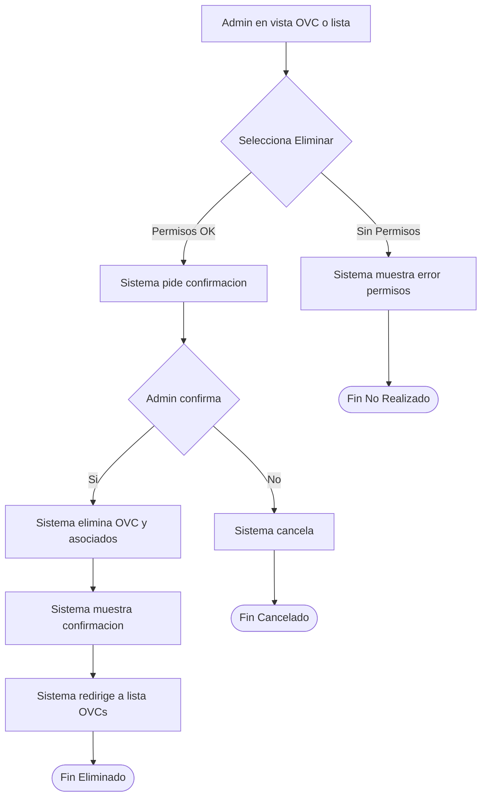
```mermaid
graph TD
    A["Admin en vista OVC o lista"] --> B{Selecciona Eliminar}
    B -- "Permisos OK" --> C["Sistema pide confirmacion"]
    C --> D{Admin confirma}
    D -- "Si" --> E["Sistema elimina OVC y asociados"]
    E --> F["Sistema muestra confirmacion"]
    F --> G["Sistema redirige a lista OVCs"]
    G --> H(["Fin Eliminado"])
    D -- "No" --> I["Sistema cancela"]
    I --> J(["Fin Cancelado"])
    B -- "Sin Permisos" --> K["Sistema muestra error permisos"]
    K --> L(["Fin No Realizado"])
```

**UC-106: Gestionar Versiones de OVC**

*   **Goal:** Un Actor (Estudiante, Profesor) desea guardar, visualizar o restaurar versiones de un OVC.
*   **Actor(s):** Estudiante, Profesor, Administrador (para visualización y gestión)
*   **Preconditions:** El Actor está editando un OVC (UC-104) o visualizando sus detalles (UC-103). El OVC existe.
*   **Flow of Events - Guardar Nueva Versión:**
    1.  Mientras edita un OVC, el Actor decide guardar los cambios actuales como una nueva versión.
    2.  El Actor selecciona la opción "Guardar como nueva versión" (o similar).
    3.  El sistema solicita opcionalmente una descripción o etiqueta para esta versión (ej. "Versión con bocetos iniciales", "Entrega Parcial 1").
    4.  El sistema guarda el estado actual del OVC como una nueva versión, vinculada al OVC principal, y registra la fecha, el autor de la versión y la descripción.
    5.  El sistema muestra un mensaje de confirmación.
*   **Flow of Events - Ver Historial de Versiones:**
    1.  Desde la vista de detalles de un OVC, el Actor selecciona la opción "Ver historial de versiones".
    2.  El sistema muestra una lista cronológica de las versiones guardadas del OVC, con sus etiquetas/descripciones, fechas y autores.
    3.  El Actor puede seleccionar una versión para ver sus detalles o una previsualización (si aplica).
*   **Flow of Events - Restaurar Versión Anterior:**
    1.  Desde el historial de versiones, el Actor selecciona una versión anterior.
    2.  El Actor selecciona la opción "Restaurar esta versión".
    3.  El sistema advierte que restaurar una versión puede sobrescribir los cambios no guardados de la versión actual o crear una nueva rama/versión a partir de la restaurada.
    4.  El Actor confirma la restauración.
    5.  El sistema restaura el contenido del OVC al estado de la versión seleccionada. La versión actual podría guardarse automáticamente antes de restaurar.
*   **Postconditions:** Se ha guardado una nueva versión del OVC, o el Actor ha visualizado el historial, o se ha restaurado una versión anterior del OVC.

**Diagrama de Flujo para UC-106 (Mermaid):**

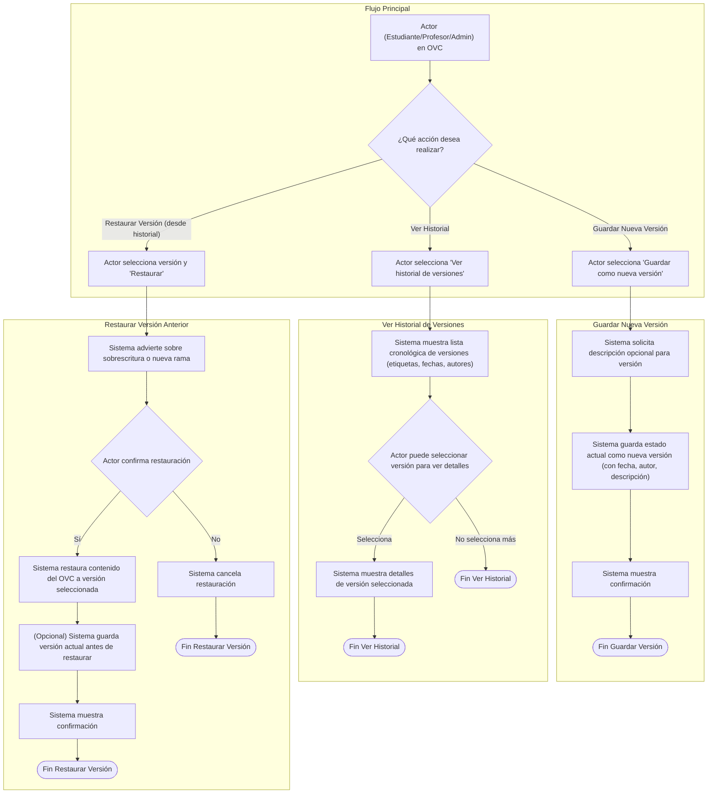
```mermaid
graph TD
    subgraph "Flujo Principal"
        A["Actor (Estudiante/Profesor/Admin) en OVC"] --> B{¿Qué acción desea realizar?}
        B -- "Guardar Nueva Versión" --> GV1["Actor selecciona 'Guardar como nueva versión'"]
        B -- "Ver Historial" --> VH1["Actor selecciona 'Ver historial de versiones'"]
        B -- "Restaurar Versión (desde historial)" --> RV1["Actor selecciona versión y 'Restaurar'"]
    end

    subgraph "Guardar Nueva Versión"
        GV1 --> GV2["Sistema solicita descripción opcional para versión"]
        GV2 --> GV3["Sistema guarda estado actual como nueva versión (con fecha, autor, descripción)"]
        GV3 --> GV4["Sistema muestra confirmación"]
        GV4 --> FIN_GV([Fin Guardar Versión])
    end

    subgraph "Ver Historial de Versiones"
        VH1 --> VH2["Sistema muestra lista cronológica de versiones (etiquetas, fechas, autores)"]
        VH2 --> VH3{Actor puede seleccionar versión para ver detalles}
        VH3 -- "Selecciona" --> VH4["Sistema muestra detalles de versión seleccionada"]
        VH4 --> FIN_VH([Fin Ver Historial])
        VH3 -- "No selecciona más" --> FIN_VH2([Fin Ver Historial])
    end

    subgraph "Restaurar Versión Anterior"
        RV1 --> RV2["Sistema advierte sobre sobrescritura o nueva rama"]
        RV2 --> RV3{Actor confirma restauración}
        RV3 -- "Sí" --> RV4["Sistema restaura contenido del OVC a versión seleccionada"]
        RV4 --> RV5["(Opcional) Sistema guarda versión actual antes de restaurar"]
        RV5 --> RV6["Sistema muestra confirmación"]
        RV6 --> FIN_RV([Fin Restaurar Versión])
        RV3 -- "No" --> RV7["Sistema cancela restauración"]
        RV7 --> FIN_RV_CANC([Fin Restaurar Versión])
    end
```

**UC-107: Gestionar Colaboradores de OVC**

*   **Goal:** El propietario de un OVC desea invitar, ver o remover colaboradores de su OVC. Un colaborador desea aceptar o rechazar una invitación.
*   **Actor(s):** Estudiante (Propietario del OVC, Colaborador invitado), Profesor (posiblemente para supervisar o ser añadido como colaborador especial).
*   **Preconditions:** El OVC existe. El Actor propietario ha iniciado sesión.
*   **Flow of Events - Invitar Colaborador:**
    1.  El Propietario del OVC, desde la vista de detalles o gestión del OVC, selecciona la opción "Gestionar Colaboradores" o "Invitar".
    2.  El sistema presenta una interfaz para buscar y seleccionar otros usuarios (Estudiantes) del sistema.
    3.  El Propietario busca y selecciona al usuario que desea invitar.
    4.  (Opcional) El Propietario asigna un rol al colaborador (ej. Editor).
    5.  El Propietario envía la invitación.
    6.  El sistema registra la invitación pendiente y notifica al usuario invitado (ver UC-601).
*   **Flow of Events - Aceptar/Rechazar Invitación de Colaboración:**
    1.  El Estudiante invitado recibe una notificación de colaboración.
    2.  El Estudiante accede a sus invitaciones pendientes o a través de la notificación.
    3.  El sistema muestra la invitación, indicando el OVC y quién lo invita.
    4.  El Estudiante selecciona "Aceptar" o "Rechazar".
    5.  Si acepta, el sistema lo añade como colaborador al OVC. El Propietario es notificado.
    6.  Si rechaza, la invitación se descarta. El Propietario es notificado.
*   **Flow of Events - Ver Colaboradores:**
    1.  El Propietario (o un colaborador existente) accede a la sección "Gestionar Colaboradores" del OVC.
    2.  El sistema muestra la lista de colaboradores actuales del OVC y sus roles (si aplica).
*   **Flow of Events - Remover Colaborador:**
    1.  El Propietario, desde la lista de colaboradores, selecciona un colaborador para remover.
    2.  El sistema solicita confirmación.
    3.  El Propietario confirma.
    4.  El sistema remueve al colaborador del OVC y le notifica.
*   **Postconditions:** Se ha enviado una invitación de colaboración, el invitado ha respondido, se ha visualizado la lista de colaboradores, o se ha removido un colaborador. Los colaboradores aceptados pueden editar el OVC según los permisos definidos (por defecto, edición completa).

**Diagrama de Flujo para UC-107 (Mermaid):**

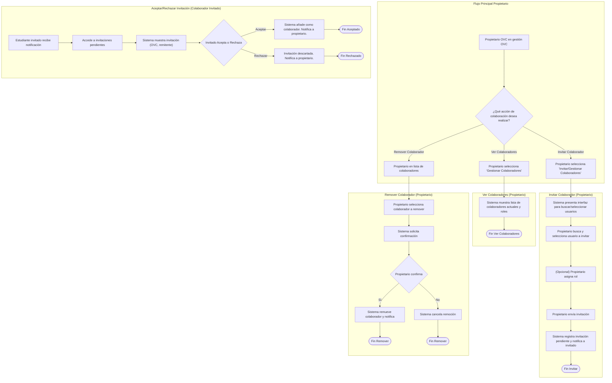
```mermaid
graph TD
    subgraph "Flujo Principal Propietario"
        A["Propietario OVC en gestión OVC"] --> B{¿Qué acción de colaboración desea realizar?}
        B -- "Invitar Colaborador" --> IC1["Propietario selecciona 'Invitar/Gestionar Colaboradores'"]
        B -- "Ver Colaboradores" --> VC1["Propietario selecciona 'Gestionar Colaboradores'"]
        B -- "Remover Colaborador" --> RC1["Propietario en lista de colaboradores"]
    end

    subgraph "Invitar Colaborador (Propietario)"
        IC1 --> IC2["Sistema presenta interfaz para buscar/seleccionar usuarios"]
        IC2 --> IC3["Propietario busca y selecciona usuario a invitar"]
        IC3 --> IC4["(Opcional) Propietario asigna rol"]
        IC4 --> IC5["Propietario envía invitación"]
        IC5 --> IC6["Sistema registra invitación pendiente y notifica a invitado"]
        IC6 --> FIN_IC([Fin Invitar])
    end

    subgraph "Aceptar/Rechazar Invitación (Colaborador Invitado)"
        AR1["Estudiante invitado recibe notificación"] --> AR2["Accede a invitaciones pendientes"]
        AR2 --> AR3["Sistema muestra invitación (OVC, remitente)"]
        AR3 --> AR4{Invitado Acepta o Rechaza}
        AR4 -- "Aceptar" --> AR5["Sistema añade como colaborador. Notifica a propietario."]
        AR5 --> FIN_AR_ACEPTA([Fin Aceptado])
        AR4 -- "Rechazar" --> AR6["Invitación descartada. Notifica a propietario."]
        AR6 --> FIN_AR_RECHAZA([Fin Rechazado])
    end

    subgraph "Ver Colaboradores (Propietario)"
        VC1 --> VC2["Sistema muestra lista de colaboradores actuales y roles"]
        VC2 --> FIN_VC([Fin Ver Colaboradores])
    end

    subgraph "Remover Colaborador (Propietario)"
        RC1 --> RC2["Propietario selecciona colaborador a remover"]
        RC2 --> RC3["Sistema solicita confirmación"]
        RC3 --> RC4{Propietario confirma}
        RC4 -- "Sí" --> RC5["Sistema remueve colaborador y notifica"]
        RC5 --> FIN_RC([Fin Remover])
        RC4 -- "No" --> RC6["Sistema cancela remoción"]
        RC6 --> FIN_RC_CANC([Fin Remover])
    end
```
---

**UC-108: Exportar OVC a Videojuego con Aprobación**

*   **Goal:** Un Estudiante desea exportar un OVC que contiene un Asset Unity o un Objeto 3D al videojuego multirol, para su inclusión en el mismo tras un proceso de supervisión y validación.
*   **Actor(s):** Estudiante, Supervisor (Profesor o Administrador), Sistema SGOVC, Sistema del Videojuego (API).
*   **Preconditions:**
    *   El Estudiante ha iniciado sesión en el sistema SGOVC.
    *   El OVC existe, es propiedad del Estudiante o tiene permisos de exportación, y contiene un Asset Unity o un Objeto 3D compatible con el videojuego.
    *   El Estudiante está visualizando la lista de OVCs (ver UC-102) o los detalles de un OVC específico (ver UC-103).
    *   Existe una API configurada y operativa para la comunicación entre el Sistema SGOVC y el servidor del videojuego.
*   **Flow of Events:**
    *   **Basic Flow (Exportación Iniciada por Estudiante y Aprobada):**
        1.  El Estudiante, desde la vista de lista de OVCs o la vista de detalles de un OVC, identifica un OVC elegible (que contiene Asset Unity/Objeto 3D).
        2.  El sistema muestra un botón o una opción "Exportar a Videojuego" para el OVC elegible.
        3.  El Estudiante selecciona la opción "Exportar a Videojuego".
        4.  El sistema marca el OVC con un estado "Pendiente de Aprobación para Videojuego" y lo añade a una cola o lista de revisión visible para los Supervisores.
        5.  El sistema notifica a los Supervisores designados sobre el nuevo OVC pendiente de aprobación (puede referenciar UC-601 Notificaciones).
        6.  Un Supervisor (Profesor o Administrador con permisos) accede a la lista de OVCs pendientes de aprobación para el videojuego.
        7.  El Supervisor revisa el OVC, su contenido (Asset Unity/Objeto 3D), y su adecuación para el videojuego.
        8.  Si el Supervisor aprueba el OVC, cambia su estado a "Aprobado para Videojuego" (o similar, ej. marcando un "check de visualización/aprobación").
        9.  Al detectar la aprobación, el Sistema SGOVC inicia el proceso de envío: empaqueta el asset relevante y lo envía al servidor del videojuego utilizando la API designada.
        10. El Sistema del Videojuego recibe el asset a través de la API.
        11. El Sistema del Videojuego realiza una validación técnica y de contenido inmediata del asset (esta validación puede ser asistida por IA).
        12. Si la validación en el Sistema del Videojuego es exitosa, este incluye el asset en una parcela designada o ubicación relevante dentro del mundo del juego, potencialmente en tiempo de ejecución para los jugadores.
        13. (Opcional) El Sistema del Videojuego, a través de la API, envía una confirmación de inclusión (o un identificador del asset en el juego) al Sistema SGOVC.
        14. El Sistema SGOVC actualiza el estado del OVC a "Exportado e Incluido en Videojuego" y notifica al Estudiante sobre el éxito de la operación.
*   **Alternative Flow - Supervisor Rechaza OVC:**
    *   En el paso 8 del Flujo Básico: Si el Supervisor no aprueba el OVC.
    *   8a. El Supervisor cambia el estado del OVC a "Rechazado para Videojuego", opcionalmente añadiendo comentarios o motivos del rechazo.
    *   8b. El Sistema SGOVC notifica al Estudiante sobre el rechazo y los motivos (si se proporcionaron). El flujo de exportación para este OVC termina.
*   **Alternative Flow - Validación en Sistema del Videojuego Falla:**
    *   En el paso 11 del Flujo Básico: Si la validación del asset por parte del Sistema del Videojuego falla.
    *   11a. El Sistema del Videojuego (idealmente a través de la API) notifica al Sistema SGOVC sobre el fallo en la validación, incluyendo los motivos si es posible.
    *   11b. El Sistema SGOVC actualiza el estado del OVC a "Fallo en Exportación a Videojuego" (o "Rechazado por Videojuego tras Envío") y notifica al Estudiante y al Supervisor que aprobó, detallando el problema. El flujo de exportación para este OVC termina.
*   **Postconditions:**
    *   **Éxito:** El OVC (o su asset relevante) ha sido aprobado, enviado, validado por el videojuego e incluido en el entorno del juego. El estado del OVC en el Sistema SGOVC se actualiza para reflejar esto.
    *   **Rechazo por Supervisor:** El OVC no se envía al videojuego. El estado del OVC en el Sistema SGOVC se actualiza para reflejar el rechazo.
    *   **Fallo en Validación del Videojuego:** El OVC fue enviado pero no pudo ser validado o incluido por el Sistema del Videojuego. El estado del OVC en el Sistema SGOVC se actualiza para reflejar este fallo.

---

**Diagrama de Flujo para UC-108 (Mermaid):**

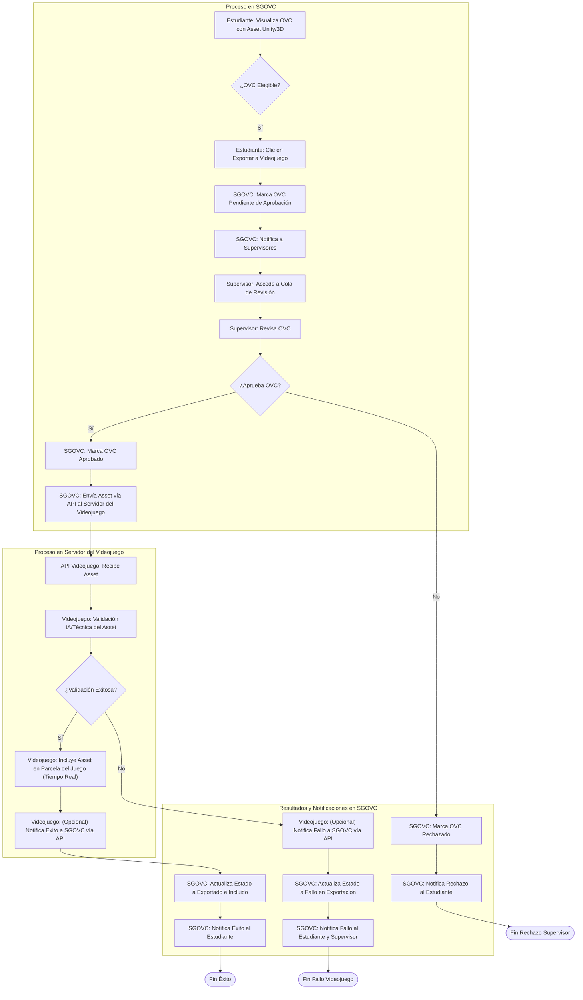
```mermaid
graph TD
    subgraph Proceso en SGOVC
        A["Estudiante: Visualiza OVC con Asset Unity/3D"] --> B{¿OVC Elegible?};
        B -- Sí --> C["Estudiante: Clic en "Exportar a Videojuego""];
        C --> D["SGOVC: Marca OVC "Pendiente de Aprobación""];
        D --> E["SGOVC: Notifica a Supervisores"];
        E --> F["Supervisor: Accede a Cola de Revisión"];
        F --> G["Supervisor: Revisa OVC"];
        G --> H{¿Aprueba OVC?};
        H -- Sí --> I["SGOVC: Marca OVC "Aprobado""];
        I --> J["SGOVC: Envía Asset vía API al Servidor del Videojuego"];
    end

    subgraph Proceso en Servidor del Videojuego
        K["API Videojuego: Recibe Asset"] --> L["Videojuego: Validación IA/Técnica del Asset"];
        L --> M{¿Validación Exitosa?};
        M -- Sí --> N["Videojuego: Incluye Asset en Parcela del Juego (Tiempo Real)"];
        N --> O["Videojuego: (Opcional) Notifica Éxito a SGOVC vía API"];
    end

    subgraph Resultados y Notificaciones en SGOVC
        J --> K;
        O --> P["SGOVC: Actualiza Estado a "Exportado e Incluido""];
        P --> Q["SGOVC: Notifica Éxito al Estudiante"];
        H -- No --> R["SGOVC: Marca OVC "Rechazado""];
        R --> S["SGOVC: Notifica Rechazo al Estudiante"];
        M -- No --> T["Videojuego: (Opcional) Notifica Fallo a SGOVC vía API"];
        T --> U["SGOVC: Actualiza Estado a "Fallo en Exportación""];
        U --> V["SGOVC: Notifica Fallo al Estudiante y Supervisor"];
    end

    Q --> W([Fin Éxito]);
    S --> X([Fin Rechazo Supervisor]);
    V --> Y([Fin Fallo Videojuego]);
```

### 3.2. Sistema de Evaluación

**UC-201: Diseñar Rúbrica**

*   **Goal:** Un Actor desea crear una nueva rúbrica de evaluación.
*   **Actor(s):** Profesor, Administrador
*   **Preconditions:** El Actor ha iniciado sesión y tiene permisos para diseñar rúbricas.
*   **Flow of Events:**
    *   **Basic Flow:**
        1.  El Actor accede a la sección de diseño de rúbricas.
        2.  El sistema presenta una interfaz para definir los criterios de evaluación, niveles de desempeño y puntuaciones.
        3.  El Actor define la   estructura y contenido de la rúbrica.
        4.  El Actor guarda la rúbrica.
        5.  El sistema valida la rúbrica y la guarda en el sistema.
        6.  El sistema muestra un mensaje de confirmación y redirige a la lista de rúbricas.
    *   **Alternative Flow - Generar con IA:**
        *   3a. El Actor utiliza la opción de generar rúbrica con IA, proporcionando un tema o descripción.
        *   3b. El sistema interactúa con la API de Google Gemini para generar una propuesta de rúbrica.
        *   3c. El Actor revisa y ajusta la rúbrica generada por IA.
        *   (Continúa en el paso 4 del flujo básico)
*   **Postconditions:** Se ha creado una nueva rúbrica en el sistema.

**Diagrama de Flujo para UC-201 (Mermaid):**

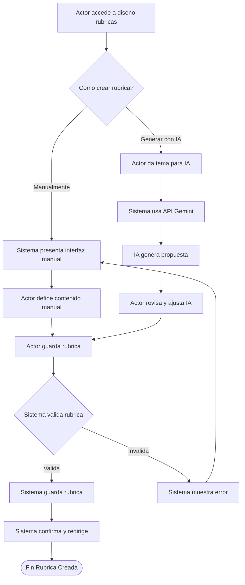
```mermaid
graph TD
    A["Actor accede a diseno rubricas"] --> B{Como crear rubrica?}
    B -- "Manualmente" --> C1["Sistema presenta interfaz manual"]
    B -- "Generar con IA" --> C2["Actor da tema para IA"]

    C1 --> D1["Actor define contenido manual"]
    D1 --> E["Actor guarda rubrica"]

    C2 --> D2["Sistema usa API Gemini"]
    D2 --> D3["IA genera propuesta"]
    D3 --> D4["Actor revisa y ajusta IA"]
    D4 --> E

    E --> F{Sistema valida rubrica}
    F -- "Valida" --> G["Sistema guarda rubrica"]
    G --> H["Sistema confirma y redirige"]
    H --> I([Fin Rubrica Creada])
    F -- "Invalida" --> J["Sistema muestra error"]
    J --> C1
```

**UC-202: Evaluar OVC Usando Rúbrica**

*   **Goal:** Un Actor desea evaluar un OVC utilizando una rúbrica existente.
*   **Actor(s):** Profesor, Administrador, Invitado, estudiante (autoevaluación y heteroevaluación)
*   **Preconditions:** El Actor tiene permisos para evaluar OVCs. Existe al menos un OVC y una rúbrica disponible para la evaluación.
*   **Flow of Events:**
    *   **Basic Flow:**
        1.  El Actor accede a la sección de evaluación de OVCs.
        2.  El sistema presenta una lista de OVCs a evaluar y las rúbricas disponibles.
        3.  El Actor selecciona un OVC y una rúbrica.
        4.  El sistema muestra la interfaz de evaluación, presentando el OVC (o un enlace a él) y la rúbrica seleccionada.
        5.  El Actor revisa el OVC y selecciona los niveles de desempeño para cada criterio de la rúbrica.
        6.  El Actor guarda la evaluación.
        7.  El sistema calcula la puntuación de la evaluación y la guarda asociada al OVC, la rúbrica y el Actor evaluador.
        8.  El sistema muestra un mensaje de confirmación.
        **Alternative Flow - ingresar a la evaluación desde el OVC:**
        1. Desde la la miniatura del OVC o desde la vista de detalles del mismo, el actor accede a la herramietna de evaluación.
        2. El actor selecciona la rúbrica con la cual va a evaluar.
        3. (Continúa en el paso 4 del flujo básico).
*   **Postconditions:** Se ha registrado una evaluación para el OVC utilizando la rúbrica seleccionada.

**Diagrama de Flujo para UC-202 (Mermaid):**

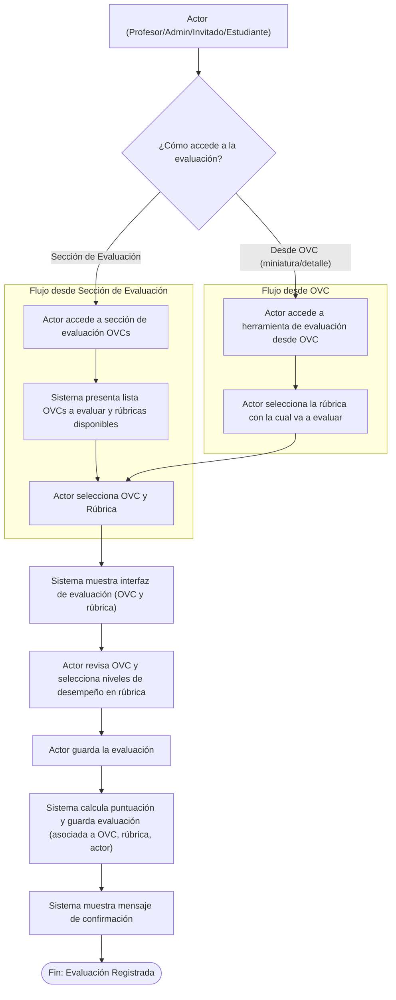
```mermaid
graph TD
    A["Actor (Profesor/Admin/Invitado/Estudiante)"] --> B{¿Cómo accede a la evaluación?}
    B -- "Sección de Evaluación" --> C1["Actor accede a sección de evaluación OVCs"]
    B -- "Desde OVC (miniatura/detalle)" --> C2["Actor accede a herramienta de evaluación desde OVC"]

    subgraph "Flujo desde Sección de Evaluación"
        C1 --> D1["Sistema presenta lista OVCs a evaluar y rúbricas disponibles"]
        D1 --> E["Actor selecciona OVC y Rúbrica"]
    end

    subgraph "Flujo desde OVC"
        C2 --> D2["Actor selecciona la rúbrica con la cual va a evaluar"]
        D2 --> E
    end

    E --> F["Sistema muestra interfaz de evaluación (OVC y rúbrica)"]
    F --> G["Actor revisa OVC y selecciona niveles de desempeño en rúbrica"]
    G --> H["Actor guarda la evaluación"]
    H --> I["Sistema calcula puntuación y guarda evaluación (asociada a OVC, rúbrica, actor)"]
    I --> J["Sistema muestra mensaje de confirmación"]
    J --> K([Fin: Evaluación Registrada])
```

**UC-203: Ver Promedios de Evaluación de OVC**

*   **Goal:** Un Actor desea ver las puntuaciones promedio de las evaluaciones de un OVC.
*   **Actor(s):** Profesor, Administrador
*   **Preconditions:** El Actor ha iniciado sesión y tiene permisos para ver promedios de evaluación. Existen OVCs con evaluaciones registradas.
*   **Flow of Events:**
    *   **Basic Flow:**
        1.  El Actor accede a la sección de promedios de evaluación.
        2.  El sistema presenta una lista de OVCs.
        3.  El Actor selecciona un OVC.
        4.  El sistema calcula y muestra las puntuaciones promedio del OVC, posiblemente desglosadas por rúbrica.
        5. EL actor puede acceder al detalle de la evaluación y ver la rúbrica con los niveles de desempeño obtenidos.
*   **Postconditions:** El Actor puede visualizar los promedios de evaluación del OVC seleccionado.

**Diagrama de Flujo para UC-203 (Mermaid):**

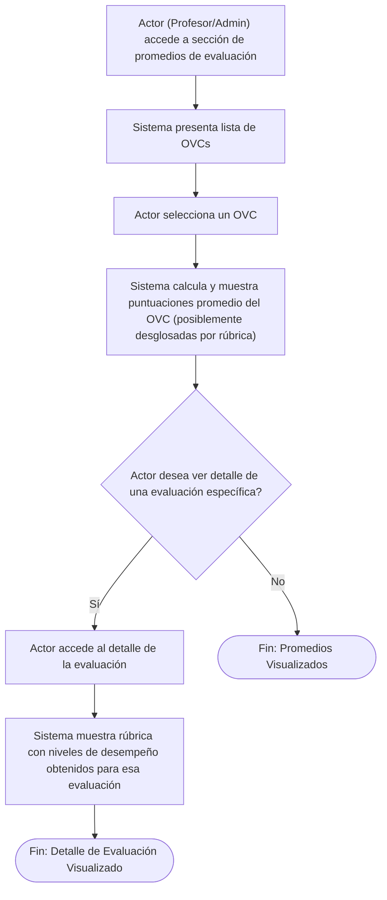
```mermaid
graph TD
    A["Actor (Profesor/Admin) accede a sección de promedios de evaluación"] --> B["Sistema presenta lista de OVCs"]
    B --> C["Actor selecciona un OVC"]
    C --> D["Sistema calcula y muestra puntuaciones promedio del OVC (posiblemente desglosadas por rúbrica)"]
    D --> E{Actor desea ver detalle de una evaluación específica?}
    E -- "Sí" --> F["Actor accede al detalle de la evaluación"]
    F --> G["Sistema muestra rúbrica con niveles de desempeño obtenidos para esa evaluación"]
    G --> H([Fin: Detalle de Evaluación Visualizado])
    E -- "No" --> I([Fin: Promedios Visualizados])
```

**UC-204: Resumir Rúbricas**

*   **Goal:** Un Actor desea obtener un resumen o análisis de las rúbricas existentes.
*   **Actor(s):** Profesor, Administrador
*   **Preconditions:** El Actor ha iniciado sesión y tiene permisos para resumir rúbricas. Existen rúbricas en el sistema.
*   **Flow of Events:**
    *   **Basic Flow:**
        1.  El Actor accede a la sección de resumen de rúbricas.
        2.  El sistema presenta una lista de rúbricas o una interfaz para seleccionar criterios de resumen.
        3.  El Actor selecciona las rúbricas a resumir o los criterios de resumen.
        4.  El sistema genera y muestra un resumen de las rúbricas seleccionadas (ej. número de rúbricas, criterios comunes, etc.).
*   **Postconditions:** El Actor obtiene un resumen de las rúbricas.

**Diagrama de Flujo para UC-204 (Mermaid):**

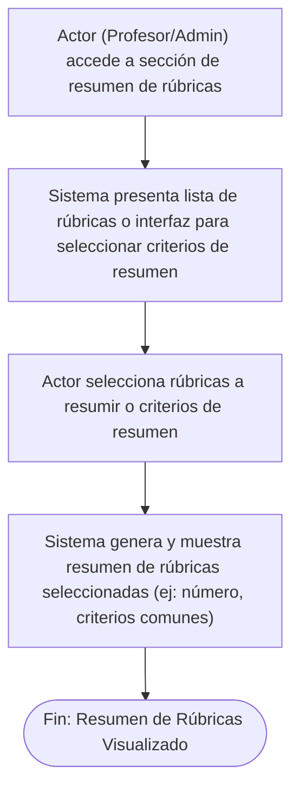
```mermaid
graph TD
    A["Actor (Profesor/Admin) accede a sección de resumen de rúbricas"] --> B["Sistema presenta lista de rúbricas o interfaz para seleccionar criterios de resumen"]
    B --> C["Actor selecciona rúbricas a resumir o criterios de resumen"]
    C --> D["Sistema genera y muestra resumen de rúbricas seleccionadas (ej: número, criterios comunes)"]
    D --> E([Fin: Resumen de Rúbricas Visualizado])
```

**UC-205: Ver Lista de Rúbricas**

*   **Goal:** Un Actor desea visualizar la lista de rúbricas disponibles en el sistema.
*   **Actor(s):** Profesor, Administrador, Invitado
*   **Preconditions:** El Actor ha accedido a la sección de rúbricas o evaluación.
*   **Flow of Events:**
    *   **Basic Flow:**
        1.  El Actor accede a la sección de rúbricas.
        2.  El sistema recupera la lista de rúbricas a las que el Actor tiene permiso de acceso (Profesor, Administrador, estudiante: todas; Invitado: posiblemente solo las designadas para evaluación de invitados).
        3.  El sistema muestra la lista de rúbricas, incluyendo información relevante como título y autor (para roles con permiso).
*   **Postconditions:** El Actor puede visualizar la lista de rúbricas según sus permisos.

**Diagrama de Flujo para UC-205 (Mermaid):**

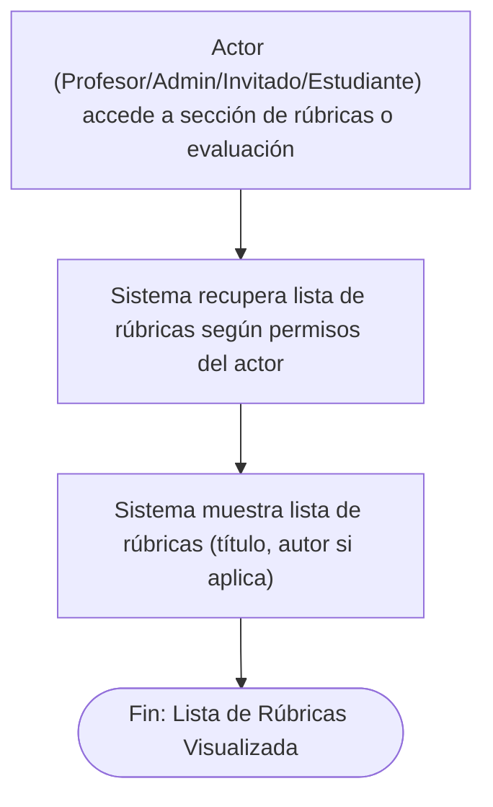
```mermaid
graph TD
    A["Actor (Profesor/Admin/Invitado/Estudiante) accede a sección de rúbricas o evaluación"] --> B["Sistema recupera lista de rúbricas según permisos del actor"]
    B --> C["Sistema muestra lista de rúbricas (título, autor si aplica)"]
    C --> D([Fin: Lista de Rúbricas Visualizada])
```

**UC-206: Ver Detalles de Rúbrica**

*   **Goal:** Un Actor desea ver la información detallada de una rúbrica específica.
*   **Actor(s):** Profesor, Administrador, Estudiante, Invitado
*   **Preconditions:** El Actor está visualizando una lista de rúbricas o tiene acceso directo a una rúbrica. El Actor tiene permisos para ver la rúbrica.
*   **Flow of Events:**
    *   **Basic Flow:**
        1.  El Actor selecciona una rúbrica de la lista o accede a ella directamente.
        2.  El sistema recupera los detalles completos de la rúbrica seleccionada (criterios, niveles de desempeño, puntuaciones).
        3.  El sistema muestra la vista detallada de la rúbrica.
*   **Postconditions:** El Actor puede visualizar toda la información detallada de la rúbrica.

**Diagrama de Flujo para UC-206 (Mermaid):**

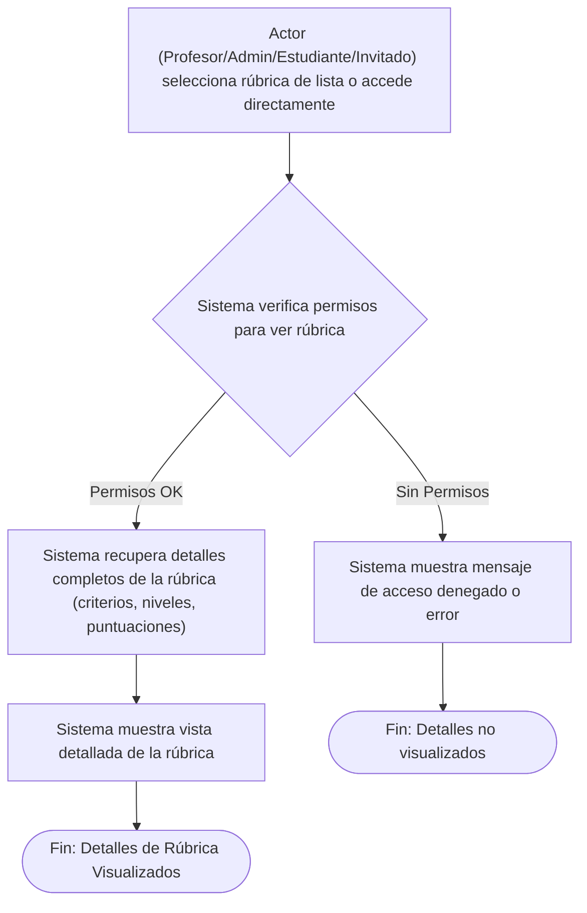
```mermaid
graph TD
    A["Actor (Profesor/Admin/Estudiante/Invitado) selecciona rúbrica de lista o accede directamente"] --> B{Sistema verifica permisos para ver rúbrica}
    B -- "Permisos OK" --> C["Sistema recupera detalles completos de la rúbrica (criterios, niveles, puntuaciones)"]
    C --> D["Sistema muestra vista detallada de la rúbrica"]
    D --> E([Fin: Detalles de Rúbrica Visualizados])
    B -- "Sin Permisos" --> F["Sistema muestra mensaje de acceso denegado o error"]
    F --> G([Fin: Detalles no visualizados])
```

**UC-207: Eliminar Rúbrica**

*   **Goal:** El Administrador desea eliminar una rúbrica del sistema.
*   **Actor(s):** Administrador
*   **Preconditions:** El Administrador ha iniciado sesión y tiene permisos para eliminar la rúbrica. El Administrador está visualizando los detalles de la rúbrica o una lista de rúbricas. 
*   **Flow of Events:**
    *   **Basic Flow:**
        1.  El Administrador selecciona la opción de eliminar para una rúbrica específica.
        2.  El sistema solicita confirmación para la eliminación.
        3.  El Administrador confirma la eliminación.
        4.  El sistema valida que la rúbrica no esté en uso en otra evaluación y la elimina.
        5.  El sistema muestra un mensaje de confirmación y redirige a la lista de rúbricas.
*   **Postconditions:** La rúbrica ha sido eliminada del sistema.

**Diagrama de Flujo para UC-207 (Mermaid):**

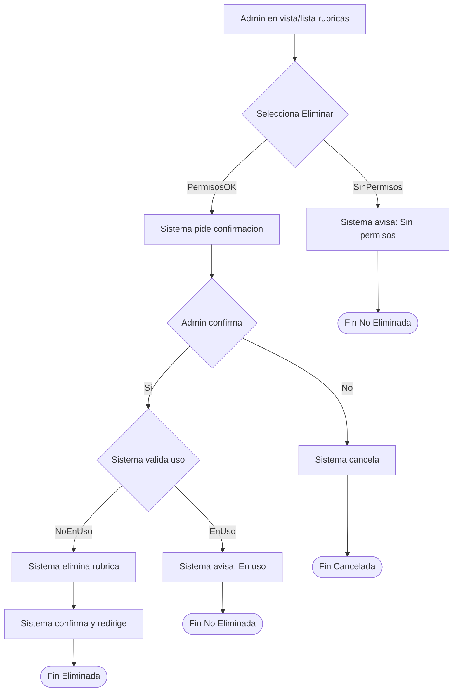
```mermaid
graph TD
    A["Admin en vista/lista rubricas"] --> B{Selecciona Eliminar}
    B -- PermisosOK --> C["Sistema pide confirmacion"]
    C --> D{Admin confirma}
    D -- Si --> E{Sistema valida uso}
    E -- NoEnUso --> F["Sistema elimina rubrica"]
    F --> G["Sistema confirma y redirige"]
    G --> H([Fin Eliminada])
    E -- EnUso --> J["Sistema avisa: En uso"]
    J --> K([Fin No Eliminada])
    D -- No --> L["Sistema cancela"]
    L --> M([Fin Cancelada])
    B -- SinPermisos --> N["Sistema avisa: Sin permisos"]
    N --> O([Fin No Eliminada])
```

**UC-208: Realizar Evaluación como Invitado**

*   **Goal:** Un Invitado desea evaluar un OVC utilizando una rúbrica designada para invitados.
*   **Actor(s):** Invitado
*   **Preconditions:** El Invitado tiene acceso al sistema (posiblemente a través de un enlace público) y existe al menos un OVC y una rúbrica designada para evaluación de invitados.
*   **Flow of Events:**
    *   **Basic Flow:**
        1.  El Invitado accede a la sección de evaluación para invitados (posiblemente a través de un enlace específico).
        2.  El sistema presenta la lista de OVCs disponibles para evaluación de invitados y las rúbricas correspondientes.
        3.  El Invitado selecciona un OVC y una rúbrica.
        4.  El sistema muestra la interfaz de evaluación, presentando el OVC (o un enlace a él) y la rúbrica seleccionada.
        5.  El Invitado revisa el OVC y selecciona los niveles de desempeño para cada criterio de la rúbrica.
        6.  El Invitado guarda la evaluación.
        7.  El sistema calcula la puntuación de la evaluación y la guarda asociada al OVC, la rúbrica y registrando que fue una evaluación de invitado (posiblemente sin identificar al invitado individualmente a menos que se implemente un registro básico).
        8.  El sistema muestra un mensaje de confirmación.
*   **Postconditions:** Se ha registrado una evaluación de invitado para el OVC utilizando la rúbrica seleccionada.

**Diagrama de Flujo para UC-208 (Mermaid):**

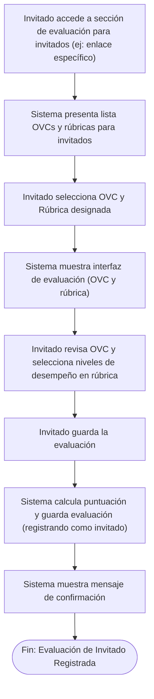
```mermaid
graph TD
    A["Invitado accede a sección de evaluación para invitados (ej: enlace específico)"] --> B["Sistema presenta lista OVCs y rúbricas para invitados"]
    B --> C["Invitado selecciona OVC y Rúbrica designada"]
    C --> D["Sistema muestra interfaz de evaluación (OVC y rúbrica)"]
    D --> E["Invitado revisa OVC y selecciona niveles de desempeño en rúbrica"]
    E --> F["Invitado guarda la evaluación"]
    F --> G["Sistema calcula puntuación y guarda evaluación (registrando como invitado)"]
    G --> H["Sistema muestra mensaje de confirmación"]
    H --> I([Fin: Evaluación de Invitado Registrada])
```

### 3.3. Tablero Kanban

**UC-301: Usar Tablero Kanban**

*   **Goal:** Un Actor desea visualizar y organizar las tareas relacionadas con un OVC utilizando un tablero Kanban.
*   **Actor(s):** Estudiante, docente, Administrador
*   **Preconditions:** El Actor ha iniciado sesión y tiene permisos para acceder al tablero Kanban (Estudiante: para su OVC; Administrador: para cualquier OVC). Existe al menos un OVC con un tablero Kanban asociado.
*   **Flow of Events:**
    *   **Basic Flow:**
        1.  El Actor accede a la sección del tablero Kanban, seleccionando el OVC si es necesario.
        2.  El sistema muestra el tablero Kanban asociado al OVC, con columnas (ej. To Do, In Progress, Done) y las tareas existentes.
        3.  El Actor puede visualizar las tareas y su estado.
*   **Postconditions:** El Actor puede visualizar el tablero Kanban del OVC.

**Diagrama de Flujo para UC-301 (Mermaid):**

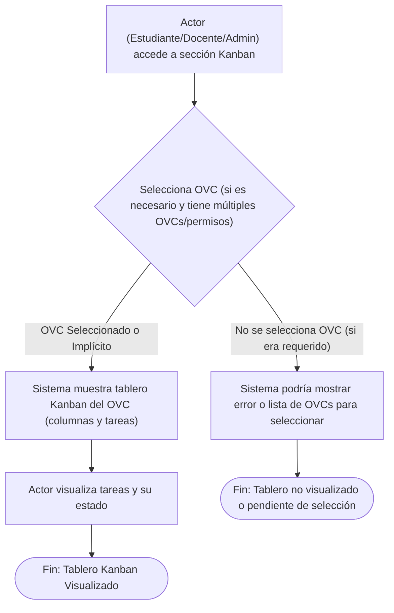
```mermaid
graph TD
    A["Actor (Estudiante/Docente/Admin) accede a sección Kanban"] --> B{"Selecciona OVC (si es necesario y tiene múltiples OVCs/permisos)"}
    B -- "OVC Seleccionado o Implícito" --> C["Sistema muestra tablero Kanban del OVC (columnas y tareas)"]
    C --> D["Actor visualiza tareas y su estado"]
    D --> E([Fin: Tablero Kanban Visualizado])
    B -- "No se selecciona OVC (si era requerido)" --> F["Sistema podría mostrar error o lista de OVCs para seleccionar"]
    F --> G([Fin: Tablero no visualizado o pendiente de selección])
```

**UC-302: Gestionar Tareas en Kanban (Crear, Editar, Mover, Eliminar)**

*   **Goal:** Un Actor desea administrar las tareas en un tablero Kanban.
*   **Actor(s):** Estudiante, Administrador
*   **Preconditions:** El Actor está visualizando un tablero Kanban al que tiene permisos de gestión.
*   **Flow of Events:**
    *   **Basic Flow - Crear Tarea:**
        1.  El Actor selecciona la opción para añadir una nueva tarea en una columna específica.
        2.  El sistema presenta una interfaz para ingresar los detalles de la tarea (título, descripción, sub-tareas, color, etc.).
        3.  El Actor completa los detalles y guarda la tarea.
        4.  El sistema crea la tarea y la añade a la columna seleccionada en el tablero Kanban.
        5.  El sistema actualiza la vista del tablero.
    *   **Basic Flow - Editar Tarea:**
        1.  El Actor selecciona una tarea existente para editar.
        2.  El sistema presenta una interfaz con los detalles actuales de la tarea pre-llenados.
        3.  El Actor modifica los detalles de la tarea.
        4.  El Actor guarda los cambios.
        5.  El sistema actualiza la tarea en el tablero Kanban.
        6.  El sistema actualiza la vista del tablero.
    *   **Basic Flow - Mover Tarea:**
        1.  El Actor arrastra una tarea de una columna a otra.
        2.  El sistema actualiza el estado de la tarea según la nueva columna.
        3.  El sistema actualiza la vista del tablero.
    *   **Basic Flow - Eliminar Tarea:**
        1.  El Actor selecciona una tarea para eliminar.
        2.  El sistema solicita confirmación para la eliminación.
        3.  El Actor confirma la eliminación.
        4.  El sistema elimina la tarea del tablero Kanban.
        5.  El sistema actualiza la vista del tablero.
        **Basic Flow - cambiar color a tarea:**
        1. El actor hace click derecho en la tarea para cambiar su color.
        2. El sistema modifica el color de la tarea y la muestra actualizada.
*   **Postconditions:** Las tareas en el tablero Kanban han sido modificadas según la acción del Actor.

**Diagrama de Flujo para UC-302 (Mermaid):**

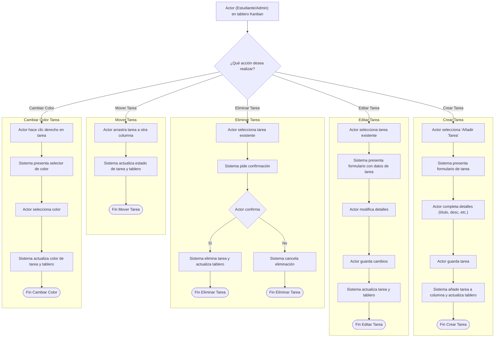
```mermaid
graph TD
    A["Actor (Estudiante/Admin) en tablero Kanban"] --> B{¿Qué acción desea realizar?}
    B -- "Crear Tarea" --> CT1["Actor selecciona 'Añadir Tarea'"]
    B -- "Editar Tarea" --> ET1["Actor selecciona tarea existente"]
    B -- "Mover Tarea" --> MT1["Actor arrastra tarea a otra columna"]
    B -- "Eliminar Tarea" --> DT1["Actor selecciona tarea existente"]
    B -- "Cambiar Color" --> CC1["Actor hace clic derecho en tarea"]

    subgraph "Crear Tarea"
        CT1 --> CT2["Sistema presenta formulario de tarea"]
        CT2 --> CT3["Actor completa detalles (título, desc, etc.)"]
        CT3 --> CT4["Actor guarda tarea"]
        CT4 --> CT5["Sistema añade tarea a columna y actualiza tablero"]
        CT5 --> FIN_CT([Fin Crear Tarea])
    end

    subgraph "Editar Tarea"
        ET1 --> ET2["Sistema presenta formulario con datos de tarea"]
        ET2 --> ET3["Actor modifica detalles"]
        ET3 --> ET4["Actor guarda cambios"]
        ET4 --> ET5["Sistema actualiza tarea y tablero"]
        ET5 --> FIN_ET([Fin Editar Tarea])
    end

    subgraph "Mover Tarea"
        MT1 --> MT2["Sistema actualiza estado de tarea y tablero"]
        MT2 --> FIN_MT([Fin Mover Tarea])
    end

    subgraph "Eliminar Tarea"
        DT1 --> DT2["Sistema pide confirmación"]
        DT2 --> DT3{Actor confirma}
        DT3 -- "Sí" --> DT4["Sistema elimina tarea y actualiza tablero"]
        DT4 --> FIN_DT([Fin Eliminar Tarea])
        DT3 -- "No" --> DT5["Sistema cancela eliminación"]
        DT5 --> FIN_DT_CANC([Fin Eliminar Tarea])
    end
    
    subgraph "Cambiar Color Tarea"
        CC1 --> CC2["Sistema presenta selector de color"]
        CC2 --> CC3["Actor selecciona color"]
        CC3 --> CC4["Sistema actualiza color de tarea y tablero"]
        CC4 --> FIN_CC([Fin Cambiar Color])
    end
```

**UC-303: Visualizar Tareas Propias en Kanban**

*   **Goal:** Un Estudiante desea visualizar todas sus tareas pendientes y en progreso de todos sus OVCs en una vista consolidada.
*   **Actor(s):** Estudiante
*   **Preconditions:** El Estudiante ha iniciado sesión en el sistema y tiene OVCs con tareas asignadas en sus respectivos tableros Kanban.
*   **Flow of Events:**
    *   **Basic Flow:**
        1.  El Estudiante accede a la sección "Mis Tareas" o una vista similar.
        2.  El sistema recupera todas las tareas asociadas al Estudiante de todos sus OVCs.
        3.  El sistema presenta una lista o tablero consolidado de estas tareas, indicando el OVC al que pertenece cada tarea, su estado (To Do, In Progress) y otros detalles relevantes (ej. fecha de vencimiento si aplica).
        4.  El Estudiante puede filtrar o agrupar las tareas (ej. por OVC, por fecha de vencimiento).
*   **Postconditions:** El Estudiante puede visualizar un resumen de todas sus tareas pendientes y en progreso de sus OVCs.

**Diagrama de Flujo para UC-303 (Mermaid):**

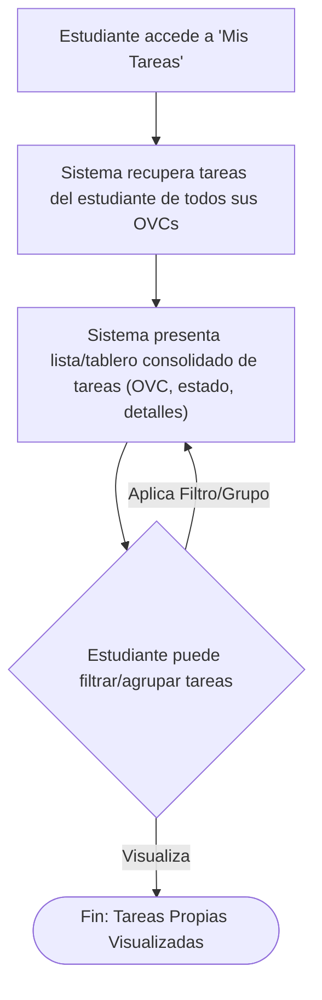
```mermaid
graph TD
    A["Estudiante accede a 'Mis Tareas'"] --> B["Sistema recupera tareas del estudiante de todos sus OVCs"]
    B --> C["Sistema presenta lista/tablero consolidado de tareas (OVC, estado, detalles)"]
    C --> D{Estudiante puede filtrar/agrupar tareas}
    D -- "Aplica Filtro/Grupo" --> C
    D -- "Visualiza" --> E([Fin: Tareas Propias Visualizadas])
```

### 3.4. Visualización Rizoma y Gestión de Tareas Global

**UC-304: Ver Visualización Rizoma**

*   **Goal:** Un Actor desea visualizar la red de relaciones entre los OVCs.
*   **Actor(s):** Estudiante, Profesor, Administrador
*   **Preconditions:** El Actor ha iniciado sesión. Existen OVCs con relaciones definidas (implícito en la funcionalidad del Rizoma).
*   **Flow of Events:**
    *   **Basic Flow:**
        1.  El Actor accede a la sección de visualización Rizoma.
        2.  El sistema recupera los datos de los OVCs y sus relaciones.
        3.  El sistema genera y muestra la visualización interactiva del Rizoma.
        4.  El Actor puede interactuar con la visualización (zoom, pan, ver detalles al pasar el mouse, etc.).
        5. El actor puede abrir la previsualización o los detalles de un OVC desde esta vista.
*   **Postconditions:** El Actor puede visualizar la red de OVCs en formato Rizoma.

**Diagrama de Flujo para UC-304 (Mermaid):**

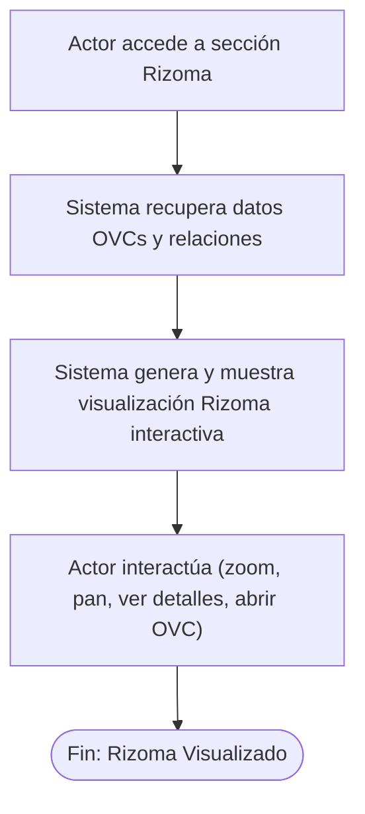
```mermaid
graph TD
    A["Actor accede a sección Rizoma"] --> B["Sistema recupera datos OVCs y relaciones"]
    B --> C["Sistema genera y muestra visualización Rizoma interactiva"]
    C --> D["Actor interactúa (zoom, pan, ver detalles, abrir OVC)"]
    D --> E([Fin: Rizoma Visualizado])
```

### 3.5. Foro

**UC-401: Ver Foro de OVC**

*   **Goal:** Un Actor desea ver las discusiones asociadas a un OVC específico.
*   **Actor(s):** Estudiante, Profesor, Administrador
*   **Preconditions:** El Actor ha iniciado sesión. Existe un OVC con un foro asociado.
*   **Flow of Events:**
    *   **Basic Flow:**
        1.  El Actor accede al foro de un OVC específico (posiblemente desde la vista de detalles del OVC o una lista de foros).
        2.  El sistema muestra la lista de temas de discusión creados para ese OVC.
        3.  El Actor puede ver los títulos de los temas y un resumen del primer mensaje.
*   **Postconditions:** El Actor puede visualizar los temas del foro para el OVC seleccionado.

**Diagrama de Flujo para UC-401 (Mermaid):**

```mermaid
graph TD
    A["Actor accede a foro de un OVC (desde detalles OVC o lista foros)"] --> B["Sistema muestra lista de temas de discusión del OVC"]
    B --> C["Actor ve títulos de temas y resumen primer mensaje"]
    C --> D([Fin: Temas del Foro Visualizados])
```

**UC-402: Crear Tema en Foro**

*   **Goal:** Un Actor desea iniciar una nueva discusión en el foro de un OVC.
*   **Actor(s):** Estudiante, Profesor, Administrador
*   **Preconditions:** El Actor ha iniciado sesión y tiene permisos para crear temas en el foro. El Actor está visualizando el foro de un OVC.
*   **Flow of Events:**
    *   **Basic Flow:**
        1.  El Actor selecciona la opción para crear un nuevo tema.
        2.  El sistema presenta un formulario para ingresar el título del tema y el contenido del primer mensaje.
        3.  El Actor completa el formulario y envía la información.
        4.  El sistema crea el nuevo tema en el foro del OVC, incluyendo el primer mensaje asociado al Actor.
        5.  El sistema muestra el nuevo tema en la lista de temas del foro.
*   **Postconditions:** Se ha creado un nuevo tema de discusión en el foro del OVC.

**Diagrama de Flujo para UC-402 (Mermaid):**

```mermaid
graph TD
    A["Actor en foro de OVC selecciona 'Crear Nuevo Tema'"] --> B["Sistema presenta formulario (título, primer mensaje)"]
    B --> C["Actor completa formulario y envía"]
    C --> D["Sistema crea nuevo tema con primer mensaje, asociado al Actor"]
    D --> E["Sistema muestra nuevo tema en lista del foro"]
    E --> F([Fin: Tema Creado])
```

**UC-403: Crear Mensaje en Tema de Foro**

*   **Goal:** Un Actor desea responder a un tema de discusión existente en el foro de un OVC.
*   **Actor(s):** Estudiante, Profesor, Administrador
*   **Preconditions:** El Actor ha iniciado sesión y tiene permisos para crear mensajes en el foro. El Actor está visualizando un tema de discusión en el foro de un OVC.
*   **Flow of Events:**
    *   **Basic Flow:**
        1.  El Actor, desde la vista de un tema de discusión, accede a la sección para añadir un nuevo mensaje.
        2.  El sistema presenta un área de texto para ingresar el contenido del mensaje.
        3.  El Actor escribe su mensaje y lo envía.
        4.  El sistema crea el nuevo mensaje y lo añade al tema de discusión, asociado al Actor.
        5.  El sistema actualiza la vista del tema de discusión para incluir el nuevo mensaje.
*   **Postconditions:** Se ha añadido un nuevo mensaje al tema de discusión en el foro del OVC.

**Diagrama de Flujo para UC-403 (Mermaid):**

```mermaid
graph TD
    A["Actor en vista de tema de discusión accede a 'Responder' o área de mensaje"] --> B["Sistema presenta área de texto para nuevo mensaje"]
    B --> C["Actor escribe mensaje y envía"]
    C --> D["Sistema crea nuevo mensaje en el tema, asociado al Actor"]
    D --> E["Sistema actualiza vista del tema con nuevo mensaje"]
    E --> F([Fin: Mensaje Creado])
```

**UC-404: Moderar Foro (Eliminar Temas/Mensajes)**

*   **Goal:** El Administrador desea eliminar temas o mensajes inapropiados del foro.
*   **Actor(s):** Administrador
*   **Preconditions:** El Administrador ha iniciado sesión y tiene permisos de moderación. El Administrador está visualizando un foro, tema o mensaje.
*   **Flow of Events:**
    *   **Basic Flow - Eliminar Tema:**
        1.  El Administrador selecciona un tema para eliminar.
        2.  El sistema solicita confirmación para eliminar el tema y todos sus mensajes asociados.
        3.  El Administrador confirma la eliminación.
        4.  El sistema elimina el tema y todos los mensajes relacionados del foro.
        5.  El sistema actualiza la vista del foro.
    *   **Basic Flow - Eliminar Mensaje:**
        1.  El Administrador selecciona un mensaje específico dentro de un tema para eliminar.
        2.  El sistema solicita confirmación para eliminar el mensaje.
        3.  El Administrador confirma la eliminación.
        4.  El sistema elimina el mensaje del tema de discusión.
        5.  El sistema actualiza la vista del tema.
*   **Postconditions:** El tema o mensaje seleccionado ha sido eliminado del foro.

**Diagrama de Flujo para UC-404 (Mermaid):**

```mermaid
graph TD
    subgraph "Flujo Principal Moderación"
        A["Administrador en foro"] --> B{¿Qué desea moderar?}
        B -- "Eliminar Tema" --> ET1["Admin selecciona tema a eliminar"]
        B -- "Eliminar Mensaje" --> EM1["Admin selecciona mensaje a eliminar (dentro de un tema)"]
    end

    subgraph "Eliminar Tema"
        ET1 --> ET2["Sistema pide confirmación (eliminar tema y mensajes asociados)"]
        ET2 --> ET3{Admin confirma}
        ET3 -- "Sí" --> ET4["Sistema elimina tema y mensajes"]
        ET4 --> ET5["Sistema actualiza vista del foro"]
        ET5 --> FIN_ET([Fin Tema Eliminado])
        ET3 -- "No" --> ET6["Sistema cancela eliminación"]
        ET6 --> FIN_ET_CANC([Fin Tema Eliminado])
    end

    subgraph "Eliminar Mensaje"
        EM1 --> EM2["Sistema pide confirmación (eliminar mensaje específico)"]
        EM2 --> EM3{Admin confirma}
        EM3 -- "Sí" --> EM4["Sistema elimina mensaje"]
        EM4 --> EM5["Sistema actualiza vista del tema"]
        EM5 --> FIN_EM([Fin Mensaje Eliminado])
        EM3 -- "No" --> EM6["Sistema cancela eliminación"]
        EM6 --> FIN_EM_CANC([Fin Mensaje Eliminado])
    end
```

### 3.6. Administración

**UC-501: Gestionar Usuarios (Crear, Editar, Eliminar)**

*   **Goal:** El Administrador desea administrar las cuentas de usuario en el sistema.
*   **Actor(s):** Administrador
*   **Preconditions:** El Administrador ha iniciado sesión y tiene permisos de administración de usuarios.
*   **Flow of Events:**
    *   **Basic Flow - Crear Usuario:**
        1.  El Administrador accede a la sección de gestión de usuarios.
        2.  El sistema presenta un formulario para ingresar los detalles del nuevo usuario (nombre, correo, contraseña inicial, rol, etc.).
        3.  El Administrador completa el formulario y guarda.
        4.  El sistema valida los datos y crea la cuenta de usuario.
        5.  El sistema muestra un mensaje de confirmación y actualiza la lista de usuarios.
    *   **Basic Flow - Editar Usuario:**
        1.  El Administrador selecciona un usuario existente de la lista.
        2.  El sistema presenta un formulario con los datos actuales del usuario.
        3.  El Administrador modifica la información necesaria y guarda los cambios.
        4.  El sistema valida y actualiza la información del usuario.
        5.  El sistema muestra un mensaje de confirmación.
    *   **Basic Flow - Eliminar Usuario:**
        1.  El Administrador selecciona un usuario de la lista.
        2.  El sistema solicita confirmación para la eliminación.
        3.  El Administrador confirma la eliminación.
        4.  El sistema elimina la cuenta del usuario (considerar políticas de retención de datos o anonimización de contribuciones).
        5.  El sistema muestra un mensaje de confirmación y actualiza la lista de usuarios.
*   **Postconditions:** La cuenta de usuario ha sido creada, editada o eliminada del sistema.

**Diagrama de Flujo para UC-501 (Mermaid):**

```mermaid
graph TD
    subgraph "Flujo Principal Gestión Usuarios"
        A["Administrador accede a gestión de usuarios"] --> B{¿Qué acción desea realizar?}
        B -- "Crear Usuario" --> CU1["Admin selecciona 'Crear Usuario'"]
        B -- "Editar Usuario" --> EU1["Admin selecciona usuario de la lista"]
        B -- "Eliminar Usuario" --> DU1["Admin selecciona usuario de la lista"]
    end

    subgraph "Crear Usuario"
        CU1 --> CU2["Sistema presenta formulario de nuevo usuario (datos, rol)"]
        CU2 --> CU3["Admin completa formulario y guarda"]
        CU3 --> CU4["Sistema valida datos y crea usuario"]
        CU4 --> CU5["Sistema muestra confirmación y actualiza lista de usuarios"]
        CU5 --> FIN_CU([Fin Usuario Creado])
    end

    subgraph "Editar Usuario"
        EU1 --> EU2["Sistema presenta formulario con datos actuales del usuario"]
        EU2 --> EU3["Admin modifica datos y/o rol y guarda"]
        EU3 --> EU4["Sistema valida datos y actualiza usuario"]
        EU4 --> EU5["Sistema muestra confirmación y actualiza lista de usuarios"]
        EU5 --> FIN_EU([Fin Usuario Editado])
    end

    subgraph "Eliminar Usuario"
        DU1 --> DU2["Sistema pide confirmación para eliminar usuario"]
        DU2 --> DU3{Admin confirma}
        DU3 -- "Sí" --> DU4["Sistema elimina usuario (considerar qué pasa con sus OVCs/contribuciones)"]
        DU4 --> DU5["Sistema muestra confirmación y actualiza lista de usuarios"]
        DU5 --> FIN_DU([Fin Usuario Eliminado])
        DU3 -- "No" --> DU6["Sistema cancela eliminación"]
        DU6 --> FIN_DU_CANC([Fin Usuario Eliminado])
    end
```

### 3.7. Notificaciones (General)

**UC-601: Recibir Notificaciones**

*   **Goal:** Un Actor desea ser informado sobre eventos relevantes en el sistema.
*   **Actor(s):** Estudiante, Profesor, Administrador
*   **Preconditions:** El Actor ha iniciado sesión o tiene configurado un canal de notificación (ej. correo electrónico).
*   **Flow of Events:**
    *   **Basic Flow:**
        1.  Un evento relevante ocurre en el sistema (ej. nueva tarea asignada, invitación de colaboración, nuevo mensaje en foro seguido, OVC evaluado).
        2.  El sistema genera una notificación para el/los Actor(es) relevante(s).
        3.  El sistema muestra la notificación dentro de la interfaz de usuario (ej. un ícono de campana con un contador) y/o la envía a través de un canal configurado.
        4.  El Actor accede a su panel de notificaciones en el sistema o revisa su canal externo.
        5.  El sistema muestra la lista de notificaciones con un resumen y un enlace al contenido relevante.
        6.  El Actor puede interactuar con la notificación (marcar como leída, seguir el enlace).
*   **Postconditions:** El Actor ha sido notificado sobre un evento relevante y puede acceder a más detalles si lo desea.

**Diagrama de Flujo para UC-601 (Mermaid):**

```mermaid
graph TD
    A["Evento relevante ocurre en el sistema (ej. nueva tarea, invitación, mensaje)"] --> B["Sistema genera notificación para Actor(es) relevantes"]
    B --> C["Sistema almacena notificación y/o la envía (ej. email, push)"]
    C --> D["Actor accede al sistema o revisa sus canales de notificación"]
    D --> E["Sistema muestra indicador de nuevas notificaciones (ej. ícono con contador)"]
    E --> F["Actor accede a su panel/lista de notificaciones"]
    F --> G["Sistema muestra lista de notificaciones (resumen, enlace al contenido)"]
    G --> H{Actor interactúa con notificación}
    H -- "Marca como leída" --> I["Sistema actualiza estado de notificación"]
    I --> J([Fin Notificación Gestionada])
    H -- "Sigue enlace" --> K["Sistema redirige a contenido relevante"]
    K --> L([Fin Notificación Atendida])
    H -- "Descarta/Cierra panel" --> M([Fin Notificación Vista])
```
## 4. Otros posibles casos de uso para más adelante

| Nombre del Caso de Uso                                  | Breve Descripción                                                                                                                               |
| :------------------------------------------------------ | :---------------------------------------------------------------------------------------------------------------------------------------------- |
| **UC-701: Gestionar Portafolio Personal de OVCs**       | Permitir a los usuarios (especialmente estudiantes) curar y presentar una selección de sus OVCs como un portafolio personal o profesional.        |
| **UC-702: Buscar OVCs Avanzado**                        | Mejorar la búsqueda actual con filtros más detallados (por tipo, fecha, popularidad, etc.) y potencialmente búsqueda semántica.                  |
| **UC-703: Recomendar OVCs**                             | Implementar un sistema que sugiera OVCs a los usuarios basándose en sus intereses, historial de visualización o evaluaciones.                   |
| **UC-704: Integración con Repositorios Externos**       | Permitir la importación/exportación o enlace de OVCs con repositorios externos (ej. GitHub, Figshare, Sketchfab).                               |
| **UC-705: Analíticas de Uso de OVCs**                   | Proveer a los creadores y profesores estadísticas sobre cómo se visualizan, evalúan o utilizan sus OVCs (vistas, descargas, tiempo de interacción). |
| **UC-706: Generar Certificados/Badges por Logros**      | Permitir la emisión de reconocimientos digitales (certificados o badges) por la creación destacada, evaluación de OVCs o finalización de módulos. |
| **UC-707: Sistema de Mentoría/Revisión por Pares**      | Facilitar que estudiantes soliciten revisión de sus OVCs a compañeros o mentores designados antes de una entrega o publicación formal.          |
| **UC-708: Marketplace/Intercambio de OVCs**             | (Opcional, si aplica al contexto) Un espacio donde los OVCs puedan ser compartidos, licenciados o incluso vendidos entre instituciones o usuarios. |